# FinOps 工具分析与选型指南

## 工具分类框架

### 分类维度
1. **付费模式**: 免费/Freemium/付费订阅/企业版
2. **开源状态**: 开源/闭源/混合模式
3. **整合难度**: 简单/中等/复杂
4. **适用场景**: 入门级/企业级/特定云平台

## 工具详细分析

### 1. 云平台原生工具

#### AWS Cost Management Suite
**官方网站**: [AWS Cost Management](https://aws.amazon.com/aws-cost-management/)

**基本信息**
- 付费模式: 免费内置 + 高级功能付费
- 开源状态: 闭源
- 整合难度: 简单
- 适用场景: AWS 用户入门首选

**云平台支持**
- AWS (全球区域及中国区 - AWS 中国 (北京)、宁夏区域)

**核心功能**
- 成本分析与可视化
- 预算设置与告警
- 成本预测与趋势分析
- 详细成本报告
- 优化建议与成本控制

**核心组件**
```
├── AWS Cost Explorer (成本浏览器)
│   ├── 功能: 成本趋势分析、预测
│   ├── 价格: 免费
│   └── 整合: 无缝集成
├── AWS Budgets (预算管理)
│   ├── 功能: 预算设置、预警通知
│   ├── 价格: 免费额度内
│   └── 整合: 简单配置
├── AWS Cost and Usage Reports
│   ├── 功能: 详细成本数据分析
│   ├── 价格: 免费
│   └── 整合: 需要数据管道
└── AWS Trusted Advisor
    ├── 功能: 成本优化建议
    ├── 价格: 基础版免费
    └── 整合: 即开即用
```

**优劣势分析**
✅ 优势:
- 与 AWS 服务深度集成
- 学习成本低
- 实时数据准确性高
- 无需额外部署

❌ 劣势:
- 仅限 AWS 平台
- 高级分析功能有限
- 自定义报表能力弱

#### Azure Cost Management
**官方网站**: [Azure Cost Management](https://azure.microsoft.com/en-us/services/cost-management/)

**基本信息**
- 付费模式: 免费内置 + 企业版付费
- 开源状态: 闭源
- 整合难度: 简单
- 适用场景: Azure/Microsoft 生态用户

**云平台支持**
- Azure (全球区域及中国区 - 世纪互联运营的Microsoft Azure中国区)

**核心功能**
- 成本分析与可视化
- 预算设置与告警
- 成本优化建议
- 多订阅管理
- 资源使用情况分析

**核心特性**
```
├── 成本分析仪表板
├── 预算和预警
├── 资源优化建议
├── 多订阅统一管理
└── Power BI 集成
```

#### Google Cloud Billing
**官方网站**: [Google Cloud Billing](https://cloud.google.com/billing)

**基本信息**
- 付费模式: 免费基础 + 高级功能付费
- 开源状态: 闭源
- 整合难度: 简单
- 适用场景: GCP 用户

**云平台支持**
- GCP (全球区域，中国区因政策原因服务受限)

**核心功能**
- 账单管理
- 成本分析
- 预算与配额管理
- 计费报告
- 消费监控

### 2. 第三方商业工具

#### CloudHealth by VMware
**官方网站**: [CloudHealth](https://www.cloudhealthtech.com/) | [Tanzu CloudHealth Product Demos](https://www.vmware.com/products/app-platform/tanzu-cloudhealth#product-demos)

**基本信息**
- 付费模式: 企业级订阅制 ($500+/月起)
- 开源状态: 闭源
- 整合难度: 中等
- 适用场景: 大型企业多云环境

**云平台支持**
- AWS (全球及中国区)
- Azure (全球及中国区)
- GCP (全球区域，中国区受限)
- Oracle Cloud
- VMware on-premise

**核心功能**
- 多云成本管理
- 资源优化
- 预算管理
- 合规监控
- 自定义报表

**功能模块截图**
以下为CloudHealth平台的主要功能界面截图：

Resource and Organization Management

Custom Dashboards

Budget Management

Forecasting
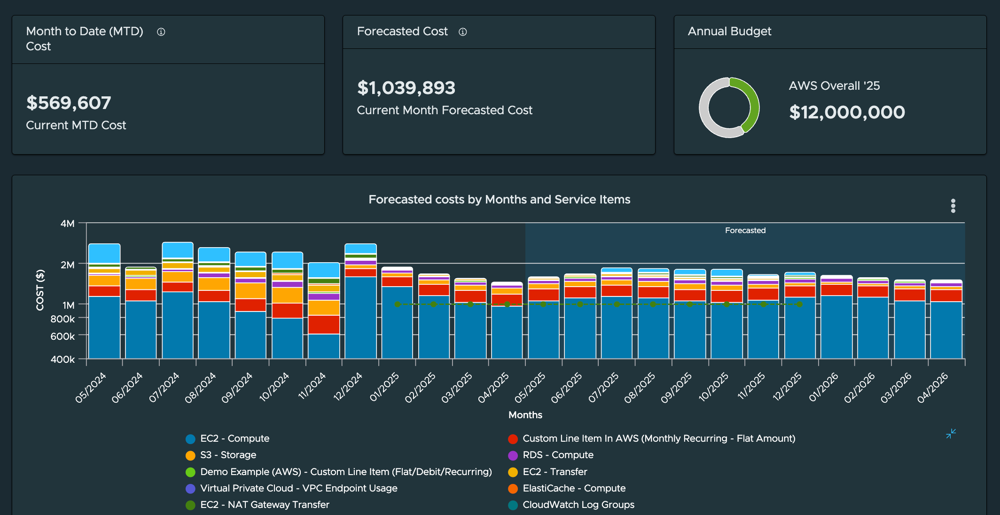
Cost Allocation and Chargeback
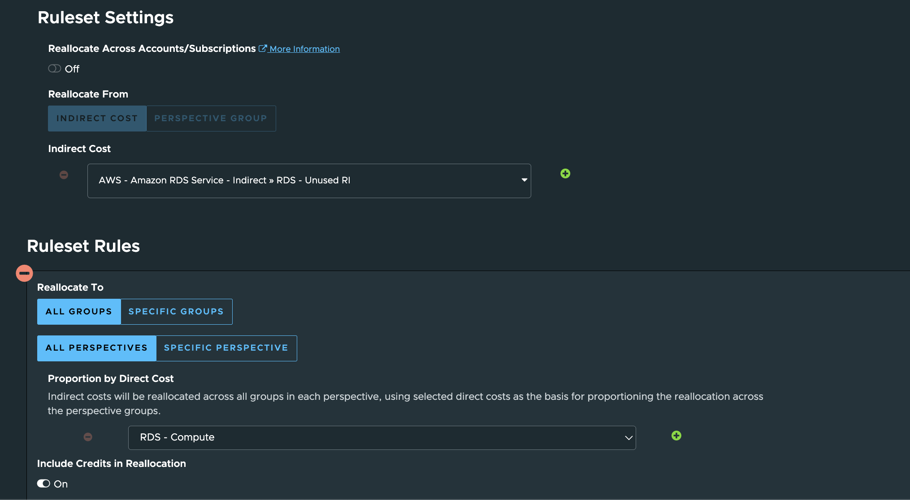
Rightsizing and Waste Reduction

Optimization
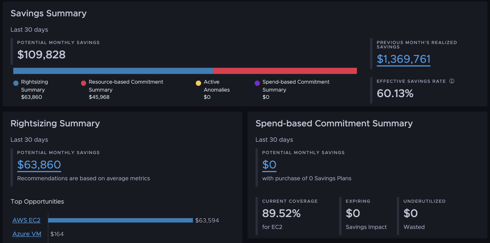
Intelligent Assist

Asset Explorer

Governance and Automation

Smart Summary

GreenOps
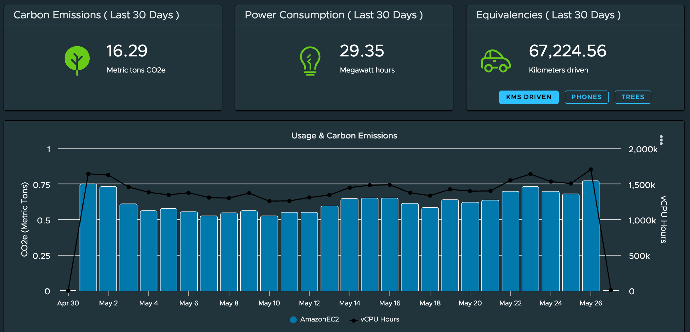

**功能矩阵**

| 功能模块 | 支持程度 | 特色优势 |
|---------|---------|---------|
| 多云成本管理 | ⭐⭐⭐⭐⭐ | 支持 AWS/Azure/GCP/Oracle |
| 资源优化 | ⭐⭐⭐⭐⭐ | AI 驱动的优化建议 |
| 预算管理 | ⭐⭐⭐⭐⭐ | 灵活的预算规则引擎 |
| 合规监控 | ⭐⭐⭐⭐ | 内置合规模板 |
| 自定义报表 | ⭐⭐⭐⭐⭐ | 强大的 BI 集成 |

**部署要求**
```
基础设施要求:
├── 最低配置: 4核CPU, 16GB内存
├── 推荐配置: 8核CPU, 32GB内存
├── 存储空间: 500GB SSD
└── 网络要求: 公网访问权限

集成复杂度:
├── 云平台API接入: 中等
├── SSO集成: 简单
├── 数据导出: 简单
└── 自定义开发: 复杂
```

#### Apptio Cloudability
**官方网站**: [Apptio Cloudability](https://www.apptio.com/products/cloudability/)

**基本信息**
- 付费模式: 企业级订阅 ($1000+/月)
- 开源状态: 闭源
- 整合难度: 中等
- 适用场景: 财务部门主导的企业

**云平台支持**
- AWS (全球及中国区)
- Azure (全球及中国区)
- GCP (全球区域，中国区受限)

**核心功能**
- 成本分摊
- 企业预算规划
- ROI 分析
- ERP 系统集成

**特色功能**
- 财务会计视角的成本分摊
- 企业预算规划工具
- ROI 分析和投资回报计算
- 与 ERP 系统集成能力

#### ProsperOps
**官方网站**: [ProsperOps](https://www.prosperops.com/)

**基本信息**
- 付费模式: 基于节省效果收费 + 按资源计费
- 开源状态: 闭源
- 整合难度: 简单到中等
- 适用场景: 多云自动化成本优化

**云平台支持**
- AWS (全球及中国区)
- Azure (全球及中国区)
- GCP (全球区域，中国区受限)

**核心功能**
- 自动化折扣管理
- 自动化资源管理
- 智能成本分摊
- 节省洞察分析

**核心功能**
```
├── Autonomous Discount Management (ADM)
│   ├── 功能: 自动化折扣管理
│   ├── 收费模式: 节省金额的百分比
│   ├── 支持平台: AWS/Azure/GCP
│   └── 特点: 无前期投入，按效果付费
├── Autonomous Resource Management (ARM)
│   ├── 功能: 自动化资源管理
│   ├── 收费模式: 按托管资源数量
│   ├── 支持平台: AWS (Azure/GCP即将支持)
│   └── 特点: 持续优化，动态调整
├── Intelligent Showback
│   ├── 功能: 智能成本分摊
│   ├── 特点: 自动重新分配承诺成本
│   └── 应用: 精确财务报告
└── Savings Insights
    ├── 功能: 节省洞察分析
    ├── 特点: 可视化净节省和有效节省率
    └── 指标: 顶级FinOps团队表现(前1-2%)
```

**技术优势**
✅ 优势:
- 真正的自动化优化，无需人工干预
- 基于AI的智能算法调整
- 平均每月节省提升68%
- 风险最小化的承诺管理
- 支持多云环境统一管理

❌ 局限性:
- 主要聚焦计算资源优化
- 对非计算资源支持有限
- 需要一定的IAM权限配置
- 依赖平台API可用性

#### Spot.io (now part of Microsoft)
**官方网站**: [Spot.io](https://spot.io/)

**基本信息**
- 付费模式: Freemium + 企业版
- 开源状态: 部分开源
- 整合难度: 中等
- 适用场景: Kubernetes 和容器化环境

**云平台支持**
- AWS (全球及中国区)
- Azure (全球及中国区)
- GCP (全球区域，中国区受限)
- Kubernetes (跨平台)

**核心功能**
- Kubernetes 自动伸缩
- 负载均衡优化
- 成本优化
- 资源管理

**开源组件**
```
├── Ocean Controller (Kubernetes)
│   ├── License: Apache 2.0
│   ├── GitHub: github.com/spotinst/ocean-controller
│   └── 功能: 自动伸缩和优化
└── Balancer
    ├── License: MIT
    ├── 功能: 负载均衡优化
    └── 集成: 多云支持
```

#### CloudMonitor
**官方网站**: [CloudMonitor](https://cloudmonitor.ai/)

**基本信息**
- 付费模式: 企业级订阅
- 开源状态: 闭源
- 整合难度: 简单
- 适用场景: Azure 云成本优化和治理

**云平台支持**
- Azure (全球及中国区 - Azure 中国区支持有限)

**核心功能**
- 自动化成本节约建议
- 成本可视化与分析
- 预算和预测管理
- 自动成本异常检测
- 云治理和安全

**核心功能**
```
├── 自动化成本节约建议
│   ├── 功能: 实时监控云资源并识别过度配置或未使用的资源
│   ├── 特点: 基于实际利用率模式提供建议
│   └── 价值: 优化资源利用率
├── 成本可视化与分析
│   ├── 功能: 灵活的仪表板和按业务单元或成本组的报告
│   ├── 特点: 自助式成本分析
│   └── 价值: 提高成本透明度
├── 预算和预测管理
│   ├── 功能: 按业务单元或项目设置消费限制
│   ├── 特点: 防止超出分配预算
│   └── 价值: 成本控制
├── 自动成本异常检测
│   ├── 功能: 检测成本突然增加并发送通知
│   ├── 特点: 预防账单冲击
│   └── 价值: 实时成本保护
├── 云治理和安全
│   ├── 功能: 自动化治理建议
│   ├── 特点: 多渠道通知 (Teams, Slack, 邮件, 短信等)
│   └── 价值: 增强安全和合规性
└── 云所有权和问责制
    ├── 功能: 启用用户理解并负责其创建的资源
    ├── 特点: 教育开发团队资源优化
    └── 价值: 促进成本意识文化
```

**技术架构**
```
核心组件:
├── 实时监控引擎
├── 成本优化算法
├── 自动化推荐系统
└── 多渠道通知服务

数据处理:
├── 24x7 全天候监控
├── 实时利用率分析
├── 成本归属和分摊
└── 异常检测算法

集成能力:
├── Azure 原生集成
├── 第三方工具集成 (Teams, Slack等)
├── 报告和仪表板系统
└── API 接口
```

**主要特性**
- 自动化FinOps生命周期管理
- 基于利用率的实时优化建议
- 按业务单元或项目的成本分组
- 多渠道告警和通知系统
- 审计日志和治理流程集成

**优劣势分析**
✅ 优势:
- 专门针对Azure优化的解决方案
- 24x7自动化成本优化
- 提供自助式可视化仪表板
- 支持多渠道通知和告警
- 结合成本优化与安全治理
- 易于实施的治理流程

❌ 局限性:
- 主要专注于Azure平台
- 需要企业级订阅费用
- 某些高级功能可能需要额外配置
- 对其他云平台支持有限

### 3. 开源工具生态系统

#### OptScale by Hystax
**官方网站**: [OptScale](https://hystax.com/documentation/optscale/index.html)

**开源代码库**: [GitHub - hystax/optscale](https://github.com/hystax/optscale)

**Live Demo**: https://my.optscale.com/

**基本信息**
- 付费模式: 企业级订阅
- 开源状态: 开源 (Apache 2.0)
- 整合难度: 中等
- 适用场景: 多云环境下的成本和性能优化

**云平台支持**
- AWS (全球及中国区)
- Azure (全球及中国区)
- GCP (全球区域，中国区受限)
- 阿里云 (全球及中国区)
- Kubernetes (跨平台)

**核心功能**
- FinOps和云成本优化能力
- 预留实例、Savings Plans和竞价实例优化
- 未使用资源检测
- 研发资源电源管理和权利化
- S3重复对象查找器
- 资源瓶颈识别
- 最优实例类型和系列选择
- Databricks支持
- S3和Redshift监控
- VM电源计划

**核心功能**
```
├── FinOps and Cloud Cost Optimization (FinOps和云成本优化)
│   ├── 功能: 全面的云成本管理、预算制定、成本分摊
│   ├── 特点: 支持多维度成本分析和可视化
│   └── 价值: 帮助企业实现FinOps成熟度模型
├── Reserved Instances, Savings Plans and Spot Instances Optimization (预留实例优化)
│   ├── 功能: 最优利用预留实例、Savings Plans和Spot Instances
│   ├── 特点: 智能推荐和自动优化
│   └── 价值: 最大化预留折扣效益，降低计算成本
├── Unused Resource Detection (未使用资源检测)
│   ├── 功能: 自动识别和标记未使用的云资源
│   ├── 特点: 基于使用率和活动指标检测
│   └── 价值: 识别浪费并建议清理
├── R&D Resource Power Management and Rightsizing (研发资源管理)
│   ├── 功能: 自动化研发资源电源管理和权利化
│   ├── 特点: 智能调整资源大小和开关时间
│   └── 价值: 优化研发环境成本
├── S3 Duplicate Object Finder (S3重复对象查找)
│   ├── 功能: 识别和管理重复的S3对象
│   ├── 特点: 深度扫描和重复数据删除
│   └── 价值: 减少存储冗余和成本
├── Resource Bottleneck Identification (资源瓶颈识别)
│   ├── 功能: 识别性能瓶颈和资源限制
│   ├── 特点: 性能监控和分析
│   └── 价值: 优化资源分配和性能
├── Optimal Instance Type and Family Selection (实例类型选择)
│   ├── 功能: 推荐最适合的实例类型和系列
│   ├── 特点: 基于工作负载特征推荐
│   └── 价值: 实现性能与成本的平衡
├── Databricks Support (Databricks支持)
│   ├── 功能: 优化Databricks环境成本和性能
│   ├── 特点: 集成Databricks监控和优化
│   └── 价值: 降低大数据分析成本
├── S3 and Redshift Instrumentation (S3和Redshift监控)
│   ├── 功能: 深度监控S3和Redshift使用情况
│   ├── 特点: 详细的性能和成本指标
│   └── 价值: 优化数据存储和分析成本
└── VM Power Schedules (虚拟机电源计划)
    ├── 功能: 自动化虚拟机开机和关机时间管理
    ├── 特点: 基于时间表的自动化
    └── 价值: 降低非工作时间的资源成本
```

**技术架构**
```
数据源类型:
├── 账单信息: 各云平台账单API
├── 资源状态: 云资源发现API
├── 监控数据: 云平台监控服务
├── 配置数据: 资源元数据
└── 性能指标: 详细的性能监控数据

支持平台:
├── AWS (通过账单导出和EC2 API)
├── Azure (通过消费API和资源管理API)
├── GCP (通过BigQuery和监控服务)
├── 阿里云 (通过计费和资源发现API)
├── Databricks (通过Databricks API)
└── Kubernetes (通过部署收集器组件)
```

**主要模块**
- Home: 组织当前支出和未来月份预测
- Recommendations: 实用的优化建议卡片
- Resources: 跨云资源支出观察
- Pools: 带限制或预测支出的资源池管理
- FinOps: 费用趋势可视化和FinOps概念
- Policies: 异常模式识别和生命周期管理
- Sandbox: K8s资源使用评估和实例定价比较
- Databricks: Databricks环境优化和成本分析
- Anomaly Detection: 异常成本检测和告警

**演示功能**
- Databricks连接: 成本和性能推荐
- 资源池: 共享环境管理
- 成本地理地图: 成本分布可视化
- VM电源计划: 自动化电源管理
- 预留实例和Savings Plans: 优化建议
- 按所有者划分的成本细分

**OptScale 平台功能截图**

以下为OptScale平台的主要功能界面截图:
home

Recommendations

Resources

Pools

Shared Environments
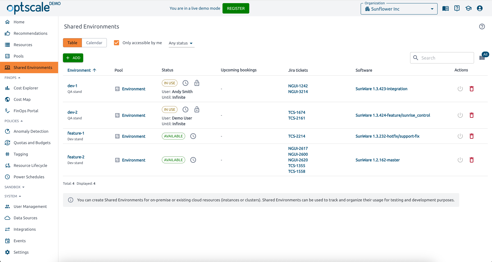
Cost Explorer

Cost Map
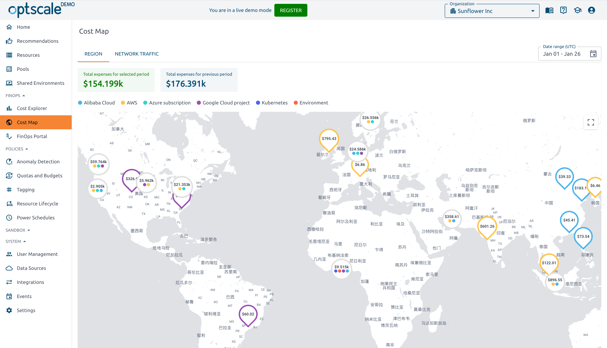
FinOps Portal

Anomaly Detection
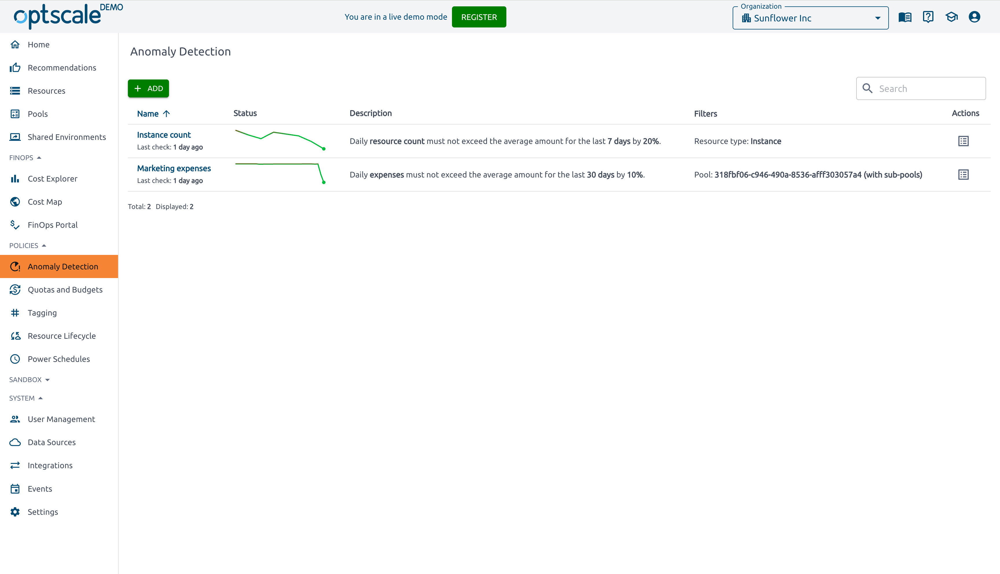
Quotas and Budgets

Tagging

Resource Lifecycle

Power Schedules
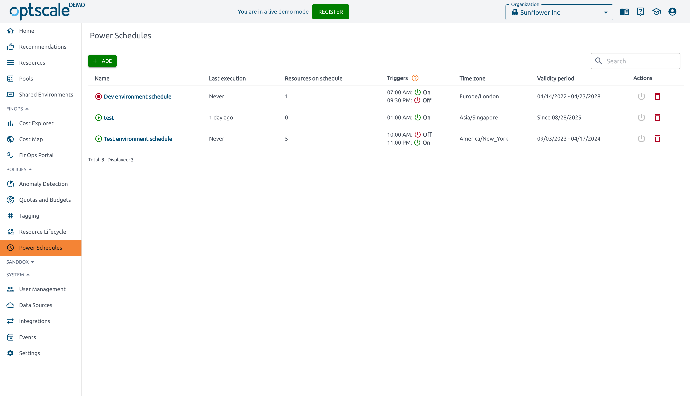
K8s Rightsizing
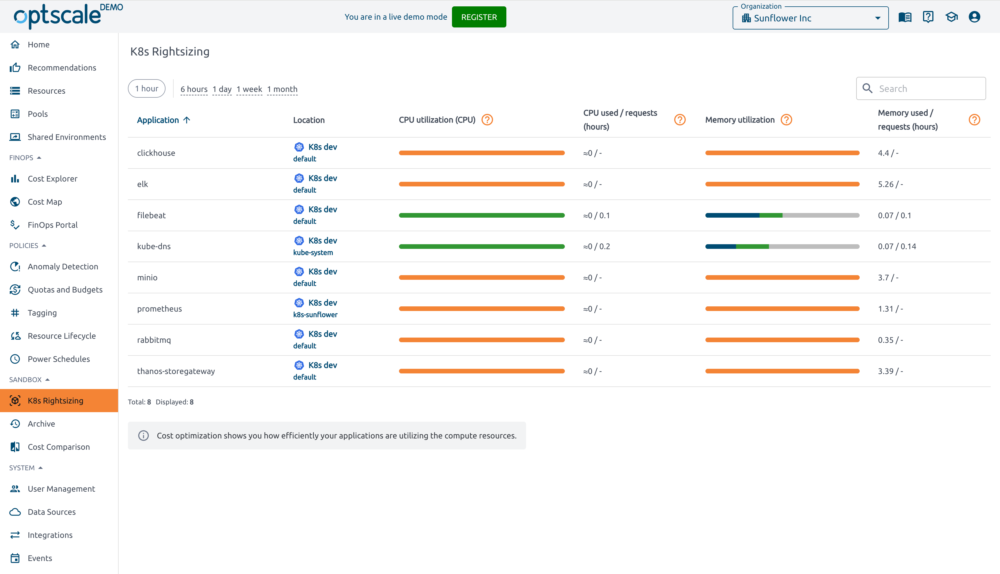
Archived

Cloud Cost Comparison

User Management

Data Sources

Integrations

Events


**优劣势分析**
✅ 优势:
- 支持多云和混合云环境
- 提供成本和性能双重优化
- 具备详细的资源池管理和透明度
- 支持自动化资源调度和生命周期管理
- 提供丰富的API和仪表板功能
- 涵盖完整的FinOps生命周期
- 支持Databricks等大数据平台优化
- 提供详细的资源瓶颈分析

❌ 局限性:
- 需要较复杂的初始配置
- 某些高级功能可能需要额外成本
- 依赖云平台只读权限的数据获取


#### OpenCost
**官方网站**: [OpenCost](https://www.opencost.io/)

**Demo地址**：https://demo.infra.opencost.io/allocation

**基本信息**
- 付费模式: 完全免费
- 开源状态: CNCF 沙箱项目 (Apache 2.0)
- 整合难度: 中等
- 适用场景: Kubernetes 成本监控

**云平台支持**
- AWS (全球及中国区)
- Azure (全球及中国区)
- GCP (全球区域，中国区受限)
- 阿里云 (全球及中国区)
- Kubernetes (跨平台)

**核心功能**
- Kubernetes 成本监控
- 资源使用分析
- 成本分摊
- 预算跟踪
- 优化建议

**技术架构**
```
架构组件:
├── Metrics Exporter
│   ├── 收集: Pod/Node 资源使用
│   ├── 计算: 实际成本分摊
│   └── 输出: Prometheus metrics
├── Cost Model
│   ├── 定价: 云提供商定价API
│   ├── 分摊: 基于使用量的成本分配
│   └── 预测: 趋势分析
└── API Server
    ├── 查询接口: RESTful API
    ├── 认证授权: RBAC 支持
    └── 扩展性: 插件化架构
```
**OpenCost功能截图**

以下为OpenCost平台的主要功能界面截图:
Cost Allocation
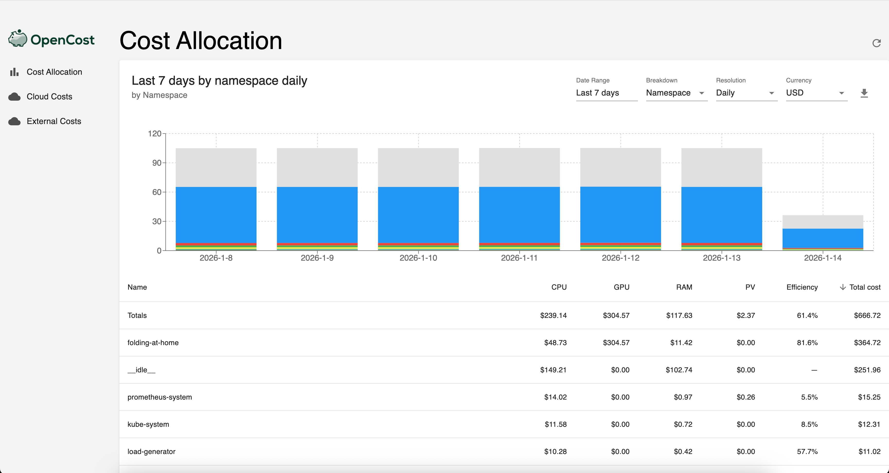
Cloud Costs

External Costs
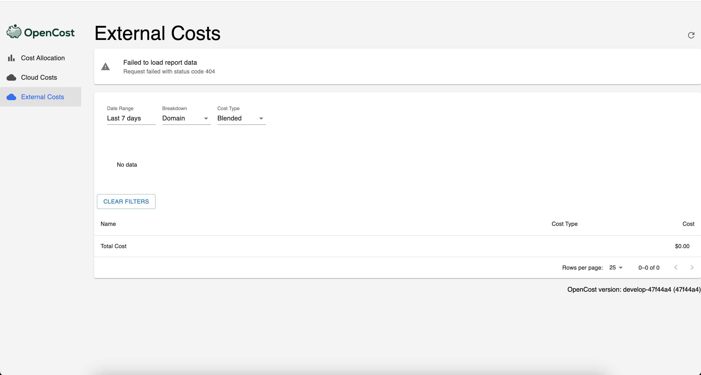


**部署方式**
```yaml
# Helm 部署示例
helm repo add opencost https://opencost.github.io/opencost-helm-chart
helm install opencost opencost/opencost \
  --set opencost.exporter.cloudProviderPrices=true \
  --set prometheus.server.persistentVolume.enabled=false
```

#### Kubecost
**官方网站**: [Kubecost](https://kubecost.com/)

**代码仓库**：https://github.com/kubecost/kubecost

**docs**: https://www.ibm.com/docs/en/kubecost/self-hosted/3.x

**基本信息**
- 付费模式: 开源版免费 + 企业版付费
- 开源状态: 核心开源 (Apache 2.0)
- 整合难度: 中等
- 适用场景: Kubernetes 成本精细化管理

**云平台支持**
- AWS (全球及中国区)
- Azure (全球及中国区)
- GCP (全球区域，中国区受限)
- 阿里云 (全球及中国区)
- 腾讯云 (全球及中国区)
- 华为云 (全球及中国区)
- Kubernetes (跨平台)

**支持的云原生资源**
- Pods, Nodes, Namespaces, Deployments, StatefulSets, DaemonSets
- Services, LoadBalancers, PersistentVolumes
- GPU资源
- 网络资源和流量

**核心功能**
- Kubernetes 成本监控
- 资源分摊
- 预算管理
- 优化建议
- 多集群支持
- 网络流量成本分配
- 外部成本跟踪
- 效率和闲置资源分析
- 集群详细信息监控
- 资产仪表板
- 云成本资源管理器
- 团队成本管理
- 服务账户成本跟踪
- 异常检测
- 审计功能
- 集合（Collections）管理

**核心功能详解**
```
├── 成本分配 (Allocations)
│   ├── 功能: 按命名空间、控制器、标签等维度分配成本
│   ├── 特点: 详细的资源使用和成本分配可视化
│   └── 价值: 实现精细化成本分摊
├── 效率和闲置资源分析
│   ├── 功能: 识别资源使用效率低下和闲置资源
│   ├── 特点: 按类型分析CPU、内存等闲置资源
│   └── 价值: 优化资源利用率，降低成本
├── 网络流量成本分配
│   ├── 功能: 追踪和分配网络流量成本
│   ├── 特点: 网络监控和成本可视化
│   └── 价值: 了解网络成本构成
├── 资产仪表板
│   ├── 功能: 展示集群和节点级别的成本
│   ├── 特点: 资产层面的成本视图
│   └── 价值: 硬件资源成本分析
├── 云成本资源管理器
│   ├── 功能: 详细的云资源成本分析
│   ├── 特点: 云提供商成本可视化
│   └── 价值: 云资源成本透明化
├── 集群详细信息
│   ├── 功能: 集群和节点详细信息监控
│   ├── 特点: 集群健康状况和资源使用
│   └── 价值: 集群运维和成本优化
├── 外部成本
│   ├── 功能: 跟踪非Kubernetes资源成本
│   ├── 特点: LoadBalancer、PV等外部资源
│   └── 价值: 完整成本视图
├── 预算和告警
│   ├── 功能: 设置预算和成本告警
│   ├── 特点: 预算监控和通知
│   └── 价值: 成本控制和预警
├── 集合（Collections）管理
│   ├── 功能: 按团队、项目等逻辑分组管理成本
│   ├── 特点: 基于标签的灵活分组
│   └── 价值: 团队级成本分摊和责任
├── 团队成本管理
│   ├── 功能: 按团队分配和管理成本
│   ├── 特点: 团队级成本仪表板
│   └── 价值: 促进成本责任制度
├── 异常检测
│   ├── 功能: 自动检测成本异常
│   ├── 特点: 智能异常识别和告警
│   └── 价值: 防范意外成本增加
└── 审计功能
    ├── 功能: 成本和资源使用审计
    ├── 特点: 详细的审计日志
    └── 价值: 合规性和成本分析
```

**架构信息**
Kubecost采用云原生架构设计，与Kubernetes生态系统深度集成。

```
Kubecost架构组件:
├── 指标收集层
│   ├── Prometheus: 收集Kubernetes和云提供商指标
│   ├── Kubernetes API: 获取集群和资源信息
│   └── 云提供商API: 获取定价和资源信息
├── 数据处理层
│   ├── 成本模型: 计算资源成本
│   ├── 分配引擎: 成本分配算法
│   └── 预测引擎: 成本预测和趋势分析
├── 存储层
│   ├── 时序数据库: 存储指标数据
│   ├── 配置存储: 存储配置和规则
│   └── 缓存层: 提高性能
└── 展示层
    ├── Web UI: 图形化仪表板
    ├── API接口: RESTful和GraphQL API
    └── 集成接口: 与其他工具集成
```

**版本对比**

| 功能 | 开源版 | 企业版 |
|-----|-------|-------|
| 基础成本监控 | ✅ | ✅ |
| 多集群支持 | ❌ | ✅ |
| 高级告警 | ❌ | ✅ |
| SSO 集成 | ❌ | ✅ |
| 自定义分摊规则 | 有限 | 完整 |
| 优先技术支持 | ❌ | ✅ |
| 高级预算管理 | ❌ | ✅ |
| 异常检测 | ❌ | ✅ |
| 集合管理 | ❌ | ✅ |
| 审计日志 | ❌ | ✅ |
| 网络成本分配 | ❌ | ✅ |
| 外部成本跟踪 | ❌ | ✅ |

**Kubecost 平台功能截图**
以下为Kubecost平台的主要功能界面截图:

Overview


Allocations Dashboard


Efficiency and Idle Resources


Network Traffic Cost Allocation
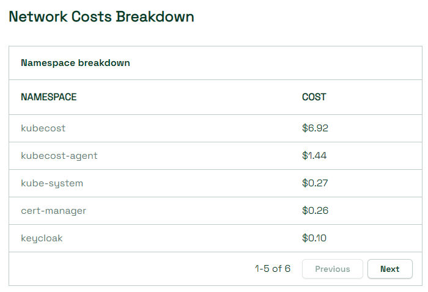

Assets Dashboard


Cloud Cost Explorer
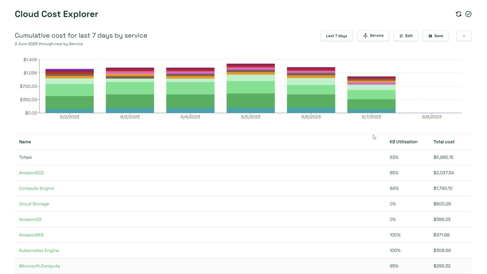

Clusters Dashboard


Cluster Details


Efficiency Dashboard


Efficiency Report


Idle by Type
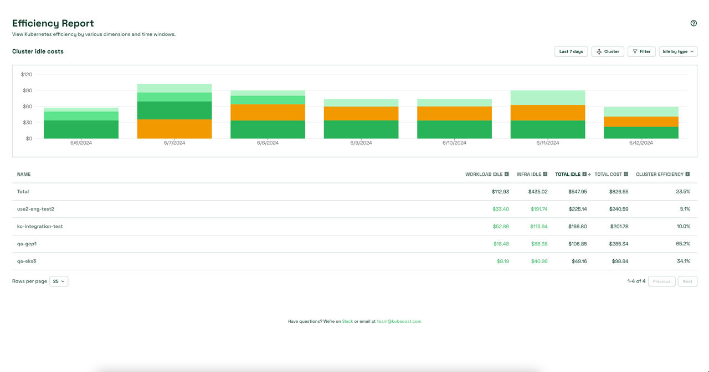

External Costs
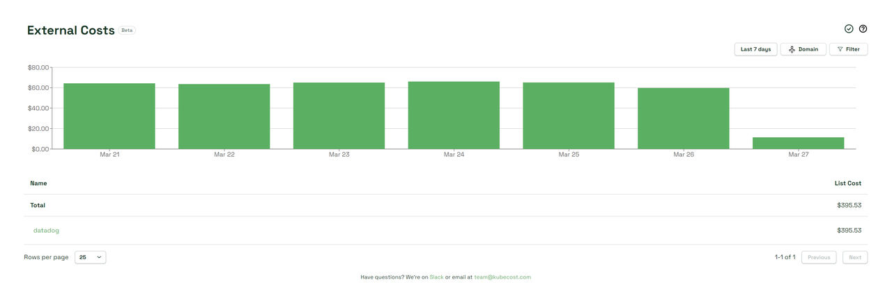

Network Monitoring


Collections


Collections Owner View
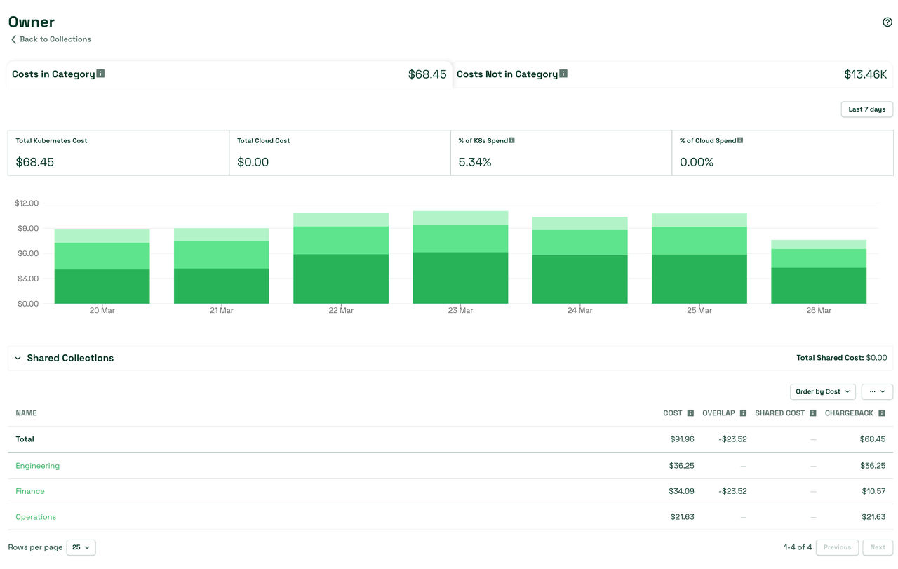

Reports


Alerts


Savings


Budgets


Audits


Anomaly Detection


Teams


Service Accounts
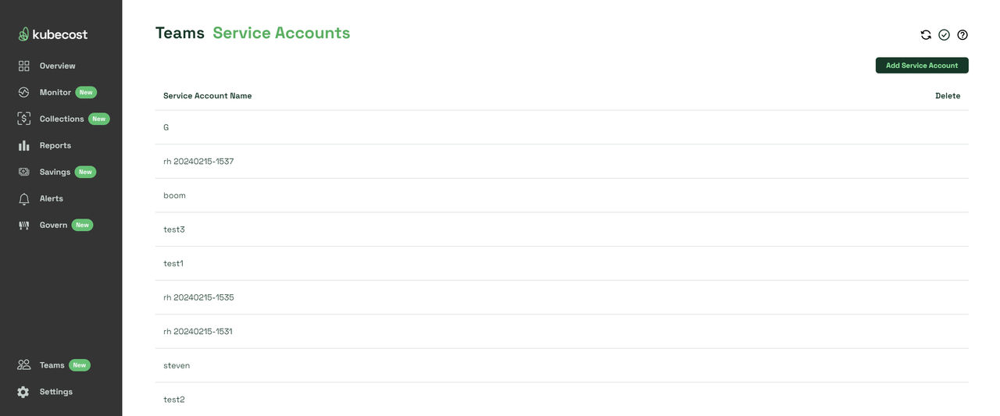

**架构图**

Kubecost Core Architecture
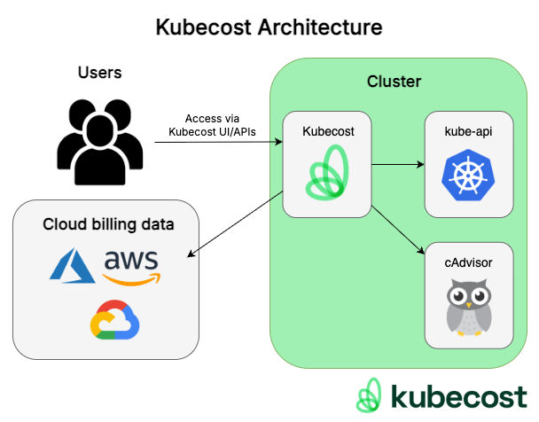

Kubecost Core Architecture Detail
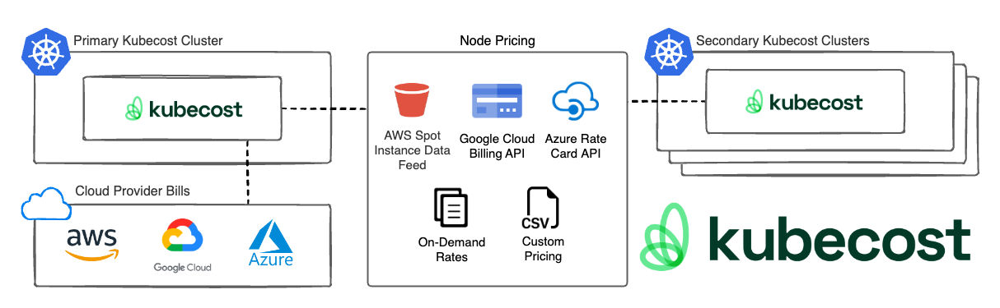

Kubecost Enterprise Architecture Overview


**文档资源**
- [如何构建DevOps工作流程中的成本意识](./asset/kubecost/how-build-cost-awareness-into-devops-workflows.pdf)
- [如何提供所需的云成本可见性](./asset/kubecost/how-to-deliver-the-cloud-cost-visibility-you-need.pdf)
- [如何成熟您的FinOps能力](./asset/kubecost/how-to-mature-your-finops-capabilities.pdf)

**安装测试文档**：hhttps://www.apptio.com/products/kubecost/install-thankyou

**优劣势分析**
✅ 优势:
- Kubernetes原生集成，深度理解K8s资源
- 提供详细的成本分配和分摊功能
- 支持多集群管理和跨集群成本分析
- 具备效率和闲置资源分析能力
- 提供网络成本分配功能
- 支持外部成本跟踪(如LoadBalancer、PV等)
- 丰富的可视化仪表板和报告
- 拥有开源版本，降低了使用门槛
- 提供API接口，便于集成
- 企业版具备高级告警和预算管理功能

❌ 局限性:
- 主要专注于Kubernetes环境
- 开源版本功能有限
- 需要访问云提供商API获取定价数据
- 多集群支持仅在企业版中提供
- 复杂的多租户管理功能需要企业版
- 对非云原生资源的支持有限

#### Infracost
**官方网站**: [Infracost](https://www.infracost.io/)

使用模式：https://dashboard.infracost.io/org/zhoumwei/onboarding

**基本信息**
- 付费模式: 开源免费 + Infracost Cloud 订阅制
- 开源状态: CLI工具完全开源 (Apache 2.0)
- 整合难度: 简单
- 适用场景: 基础设施即代码成本预估
- 商业模式: 主打Cloud SaaS模式，不适用于自部署

**商业模式说明**
CloudQuery采用混合商业模式：
- CLI工具完全开源免费，可在本地自部署
- CloudQuery Cloud平台提供企业级功能，采用订阅制收费
- Web管理界面和高级功能仅通过云服务提供，不支持自部署
- 数据需要上传到CloudQuery云平台进行处理和展示
- 支持免费试用，企业版按使用量和功能付费


**云平台支持**
- AWS (全球及中国区)
- Azure (全球及中国区)
- GCP (全球区域，中国区受限)
- 阿里云 (全球及中国区)
- 非云基础设施 (IaC)

**核心功能**
- IaC 成本预估
- CI/CD 集成
- PR 成本分析
- 多云支持
- 预算告警
- 成本治理策略
- 标签管理
- 报告生成
- 自定义价格手册
- 成本防护机制
- 活动管理
- Issue探索

**核心功能详解**
```
├── IaC 成本预估
│   ├── 功能: 基础设施即代码成本预测
│   ├── 支持: Terraform, Terragrunt, OpenTofu, CloudFormation
│   └── 价值: 部署前成本评估
├── CI/CD 集成
│   ├── 功能: 持续集成/持续部署成本分析
│   ├── 集成: GitHub Actions, GitLab CI, Jenkins等
│   └── 价值: 自动化成本检查
├── PR 成本分析
│   ├── 功能: Pull Request成本影响分析
│   ├── 特点: 代码审查时显示成本变化
│   └── 价值: 早期成本控制
├── 成本治理策略
│   ├── 功能: FinOps政策和治理规则
│   ├── 特点: 自动化合规检查
│   └── 价值: 确保成本治理
├── 标签管理
│   ├── 功能: 资源标签和成本分摊
│   ├── 特点: 自动标签建议
│   └── 价值: 精细化成本归属
├── 成本防护机制
│   ├── 功能: 预算阈值和成本控制
│   ├── 特点: 实时成本防护
│   └── 价值: 防止成本超支
├── 活动管理
│   ├── 功能: 成本优化活动和倡议
│   ├── 特点: 结构化优化流程
│   └── 价值: 系统化成本改进
└── Issue探索
    ├── 功能: 成本相关问题发现和跟踪
    ├── 特点: 智能问题识别
    └── 价值: 主动成本优化
```

**Infracost 平台功能截图**
以下为Infracost Cloud平台的主要功能界面截图:

Overview Dashboard


Issue Explorer


Campaigns


FinOps Policies
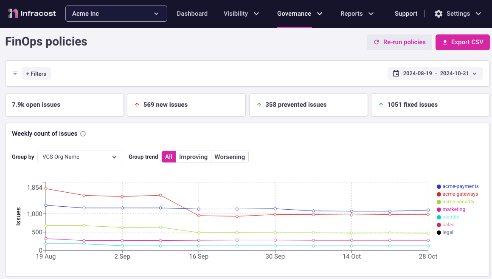

Tagging


Cost Guardrails
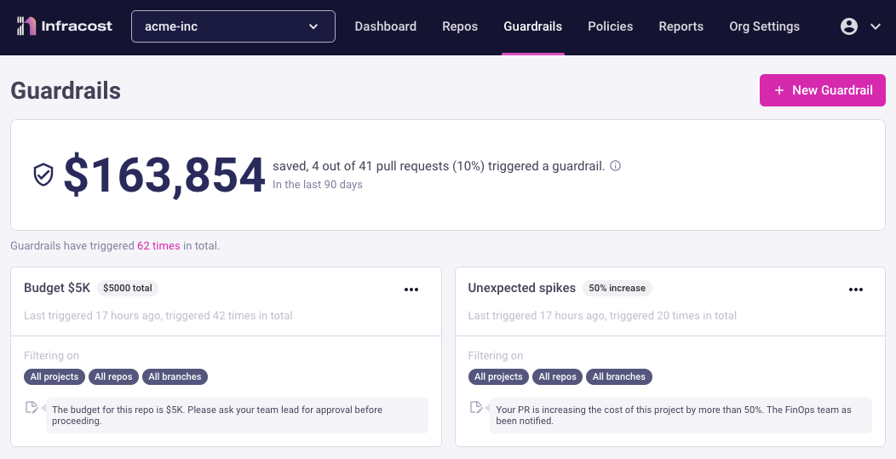

Reports


Custom Price Books


Plans & Pricing


付费模式


**优劣势分析**
✅ 优势:
- CLI工具完全开源免费，降低使用门槛
- 与主流IaC工具深度集成(Terraform等)
- 提供PR级别的成本影响分析
- Infracost Cloud提供企业级治理功能
- 支持多云成本预估
- 实时成本防护和预算控制
- 丰富的报告和分析功能

❌ 局限性:
- 不支持自部署，必须使用云服务
- 企业功能需要订阅付费
- 依赖网络连接访问云服务
- 数据需要上传到第三方平台
- 高级治理功能仅在Cloud版本中提供

#### CloudQuery
**官方网站**: [CloudQuery](https://www.cloudquery.io/)
**开源代码仓库**: [GitHub - cloudquery/cloudquery](https://github.com/cloudquery/cloudquery)

**基本信息**
- 付费模式: CLI开源免费 + Cloud平台订阅制
- 开源状态: 仅CLI开源 (MPL 2.0)，Web平台闭源
- 整合难度: 中等
- 适用场景: 云配置和安全数据管道
- 部署模式: CLI可自部署，Web平台仅Cloud服务

**商业模式说明**
CloudQuery采用混合商业模式：
- CLI工具完全开源免费，可在本地自部署
- CloudQuery Cloud平台提供企业级功能，采用订阅制收费
- Web管理界面和高级功能仅通过云服务提供，不支持自部署
- 数据需要上传到CloudQuery云平台进行处理和展示
- 支持免费试用，企业版按使用量和功能付费

**云平台支持**
- AWS (全球及中国区)
- Azure (全球及中国区)
- GCP (全球区域，中国区受限)
- 阿里云 (全球及中国区)
- 腾讯云 (全球及中国区)
- 华为云 (全球及中国区)
- 70+ 云和SaaS平台

**核心功能**
- 云资产库存管理
- 云安全态势管理 (CSPM)
- FinOps 数据收集
- ELT 数据管道
- 攻击面管理
- 数据孤岛消除
- 多云资源发现
- 配置合规性检查
- 实时监控和告警
- 自动化数据同步
- 高性能数据转换
- 企业级数据治理

**核心功能详解**
```
├── 云资产库存管理
│   ├── 功能: 统一收集云配置数据
│   ├── 支持: AWS, GCP, Azure 及70+云和SaaS来源
│   ├── 特点: 实时资源发现和配置跟踪
│   └── 价值: 全面掌握云资源配置
├── 云安全态势管理 (CSPM)
│   ├── 功能: 监控和执行安全策略
│   ├── 范围: AWS, GCP, Azure 等多云环境
│   ├── 特点: 持续合规性监控和风险评估
│   └── 优势: 持续安全合规检查
├── FinOps 数据收集
│   ├── 功能: 统一云提供商账单数据
│   ├── 目的: 优化云支出成本
│   ├── 特点: 高性能数据同步
│   └── 价值: 精准成本分析和预算控制
├── ELT 数据管道
│   ├── 功能: API 到数据库的可靠高效导出
│   ├── 特点: 可扩展架构，基于Apache Arrow
│   ├── 支持: PostgreSQL, MySQL, Snowflake等
│   └── 优势: 支持数百种集成组合
├── 攻击面管理
│   ├── 功能: 连续发现和监控潜在攻击向量
│   ├── 用途: 组织攻击面分析
│   ├── 特点: 自动化威胁检测
│   └── 价值: 增强安全态势感知
├── 数据孤岛消除
│   ├── 功能: 统一组织内各部门数据
│   ├── 范围: 安全、基础设施、营销、财务团队
│   ├── 特点: 跨部门数据整合
│   └── 价值: 促进跨团队数据共享
├── 多云资源发现
│   ├── 功能: 自动发现和 catalog 所有云资源
│   ├── 特点: 支持深度资源属性收集
│   └── 价值: 构建完整的云资产视图
├── 配置合规性检查
│   ├── 功能: 自动化安全和合规性评估
│   ├── 特点: 内置行业标准检查
│   └── 价值: 确保基础设施合规性
├── 实时监控和告警
│   ├── 功能: 持续监控资源配置变更
│   ├── 特点: 实时告警和通知
│   └── 价值: 快速响应配置漂移
└── 企业级数据治理
    ├── 功能: 数据质量、血缘和治理
    ├── 特点: 企业级安全和治理功能
    └── 价值: 满足企业合规要求
```

**技术架构**
```
核心架构组件:
├── CloudQuery CLI
│   ├── 功能: 命令行界面和核心执行引擎
│   ├── 特点: 跨平台支持，易于自动化
│   └── 语言: Go语言编写，高性能
├── Plugin System
│   ├── Source Plugins: 云提供商和SaaS数据源插件
│   ├── Destination Plugins: 数据库和数据湖目标插件
│   ├── Transformation Plugins: 数据转换和处理插件
│   └── 特点: 开放插件系统，支持自定义开发
├── 数据处理引擎
│   ├── Apache Arrow: 高性能内存数据格式
│   ├── 并行处理: 多线程数据处理
│   ├── 内存优化: 零拷贝数据传输
│   └── 特点: 亚秒级大规模数据处理
├── 配置管理层
│   ├── YAML配置: 声明式配置管理
│   ├── 环境变量: 安全的凭证管理
│   ├── 模板支持: 动态配置生成
│   └── 版本控制: 配置变更追踪
└── 监控和治理
    ├── 指标收集: 性能和运行状态监控
    ├── 日志系统: 详细的执行日志
    ├── 告警机制: 异常情况及时通知
    └── 审计跟踪: 完整的操作审计

数据处理流程:
├── 初始化: 加载配置和插件
├── 发现阶段: 识别目标资源和数据
├── 提取阶段: 从源系统获取原始数据
├── 转换阶段: 数据清洗、标准化和 enrich
├── 加载阶段: 写入目标系统
├── 验证阶段: 数据质量和完整性检查
└── 清理阶段: 资源释放和状态更新

部署架构选项:
├── 本地部署
│   ├── 优势: 完全控制，数据隐私
│   ├── 适用: 企业内部环境
│   └── 要求: 基础设施管理能力
├── 容器化部署
│   ├── Docker: 标准化容器镜像
│   ├── Kubernetes: 编排和自动扩缩容
│   ├── 优势: 便携性和一致性
│   └── 适用: 云原生环境
├── CI/CD集成
│   ├── GitHub Actions: 自动化流水线
│   ├── GitLab CI: 持续集成支持
│   ├── Jenkins: 企业级CI/CD
│   └── 优势: 基础设施即代码
└── 云托管选项
    ├── AWS Lambda: 无服务器执行
    ├── Google Cloud Functions: 云函数集成
    ├── Azure Functions: 微软云集成
    └── 优势: 无需管理基础设施
```

**CloudQuery 平台功能截图**
以下为CloudQuery平台的主要功能界面截图:

Dashboard Overview


Source Configuration


Destination Setup


Sync Progress


Data Quality Reports


Security Compliance


Performance Metrics


Getting Started Guide


Home Dashboard


Billing & Usage


Team Settings


**主要特性**
- 专业化插件覆盖: 支持复杂的云基础设施和安全数据
- 高性能数据移动: 基于Apache Arrow的大容量数据传输
- CLI本地运行: 核心数据处理可在本地完成
- 可组合性: 支持多种语言、目的地和编排工具
- 开发者友好: 代码优先、可扩展插件、开放插件系统
- 企业级安全: 符合SOC2、GDPR等合规要求
- 多云支持: 统一管理AWS、Azure、GCP等多云环境
- 实时处理: 亚秒级数据处理和同步能力

**优劣势分析**
✅ 优势:
- 支持100+云和SaaS平台的广泛集成
- 高性能数据同步，基于Apache Arrow技术
- CLI工具可在用户基础设施上运行，保障基础数据隐私
- 灵活可组合，适应现有技术栈和工作流
- 开发者友好的代码优先方法，支持多语言SDK
- 适用于多种用例 (CSPM、FinOps、ASM、数据治理等)
- 企业级安全特性，符合SOC2、GDPR等合规要求
- 实时数据处理能力，支持流式数据同步
- 开放插件系统，支持自定义数据源和目标
- 完善的监控和告警机制

❌ 局限性:
- 需要一定技术水平进行CLI部署和维护
- 大规模数据同步需要充足的计算和存储资源
- 复杂的多云环境配置可能需要专业知识
- Web平台功能必须依赖CloudQuery云服务
- 高级分析和可视化功能需要数据上传到云平台
- 无法完全自部署Web管理界面
- 企业版功能需要商业许可证
- 插件生态虽然丰富但需要选择合适的插件组合

#### OpenOps
**官方网站**: [OpenOps](https://openops.com/)
**开源代码库**: [GitHub - openops-cloud/openops](https://github.com/openops-cloud/openops)

**基本信息**
- 付费模式: 开源免费 + 托管服务
- 开源状态: 完全开源 (Apache 2.0)
- 整合难度: 中等
- 适用场景: 无代码 FinOps 自动化平台

**云平台支持**
- AWS (全球及中国区)
- Azure (全球及中国区)
- GCP (全球区域，中国区受限)
- 阿里云 (全球及中国区)
- 腾讯云 (全球及中国区)
- 华为云 (全球及中国区)
- 通用云平台支持

**核心功能**
- 预构建 FinOps 工作流
- 无代码体验
- 工作流版本管理
- 深度集成能力
- 人工控制机制
- 集中化管理

**核心功能**
```
├── 预构建 FinOps 工作流
│   ├── 功能: 包含最佳实践的工作流库
│   ├── 覆盖: 成本优化、标记、预算、分配和报告
│   └── 特点: 由 FinOps 领导者设计
├── 无代码体验
│   ├── 功能: 面向非技术人员的易用性
│   ├── 特点: 需要时可进入代码模式
│   └── 优势: 降低使用门槛
├── 灵活工作流编辑器
│   ├── 功能: 专用的无代码编辑器
│   ├── 用途: 从零构建或自定义现有工作流
│   └── 价值: 高度可定制化
├── 深度集成能力
│   ├── 功能: 与主流云提供商原生连接
│   ├── 集成: 数据库、分析工具、通信平台
│   └── 支持: 项目管理系统
├── 人工控制机制
│   ├── 功能: 关键审批流程的人工控制
│   ├── 渠道: 多渠道HITL控制
│   └── 价值: 确保关键决策的准确性
├── 工作流版本管理
│   ├── 功能: 测试工作流步骤和版本维护
│   ├── 追踪: 详细日志记录每个动作
│   └── 优势: 完全可追溯性
└── 集中化管理
    ├── 功能: 日志和处理优化机会
    ├── 表格: 支持批准、驳回、标记误报和延后
    └── 价值: 统一操作中心
```

**技术架构**
```
核心组件:
├── OpenOps Tables (类似Excel的数据库)
├── OpenOps Analytics (可视化系统)
└── 无代码工作流引擎

支持平台:
├── 云提供商: AWS, Azure, GCP
├── 数据库: 多种数据库系统
├── 通信平台: Slack 等协作工具
└── 项目管理: Jira, Trello 等工具

部署选项:
├── 托管云服务: 自动更新和维护
├── Docker Compose: 本地或云端安装
└── 企业私有化: 安全合规部署
```

**主要模块**
- 工作流模板管理: 预构建和自定义工作流
- OpenOps Tables: 类似Excel的数据库
- OpenOps Analytics: 内置可视化分析
- 人工控制: 关键流程审批机制
- 版本控制: 工作流版本管理和追踪

**优劣势分析**
✅ 优势:
- 无代码操作，易于非技术人员使用
- 与主流云平台深度集成
- 提供预构建的最佳实践工作流
- 支持人工控制确保准确性
- 开源且提供多种部署选项
- 促进跨团队协作

❌ 局限性:
- 作为相对较新的平台，社区可能较小
- 高级功能可能需要学习曲线
- 某些特定需求可能需要定制开发
- 依赖外部集成的稳定性

### 4. 自建解决方案工具链

#### Prometheus + Grafana 组合
**基本信息**
- 付费模式: 完全免费
- 开源状态: 完全开源
- 整合难度: 复杂
- 适用场景: 技术能力强的团队

**云平台支持**
- AWS (全球及中国区)
- Azure (全球及中国区)
- GCP (全球区域，中国区受限)
- 阿里云 (全球及中国区)
- 腾讯云 (全球及中国区)
- 华为云 (全球及中国区)
- 本地部署 (跨平台)

**核心功能**
- 多云监控
- 成本可视化
- 自定义仪表板
- 告警系统
- 数据聚合分析

**架构设计**
```
数据采集层:
├── CloudWatch Exporter (AWS)
├── Azure Metrics Exporter
├── GCP Stackdriver Exporter
└── 自定义 Exporter

存储层:
├── Prometheus TSDB
├── Long-term Storage (Thanos/Cortex)
└── 成本数据聚合

可视化层:
├── Grafana 仪表板
├── 自定义面板
└── 告警规则
```

#### 自研成本分摊引擎
**技术栈选择**
```
后端服务:
├── Go/Python: 高性能计算
├── PostgreSQL: 成本数据存储
├── Redis: 缓存和会话
└── Kafka: 异步处理

前端界面:
├── React/Vue: 现代化 UI
├── D3.js: 数据可视化
└── Ant Design: 组件库

集成能力:
├── RESTful API
├── GraphQL 接口
├── Webhook 通知
└── 数据导出 (CSV/Excel)
```

## 工具选型决策矩阵

### 决策因素权重表

| 评估维度 | 权重 | 评分标准 |
|---------|------|---------|
| 成本效益 | 25% | ROI 计算、TCO 分析 |
| 功能匹配度 | 20% | 核心需求覆盖程度 |
| 技术复杂度 | 15% | 部署维护难度 |
| 扩展性 | 15% | 未来发展适应性 |
| 生态集成 | 15% | 与其他系统兼容性 |
| 支持服务 | 10% | 文档、社区、商业支持 |

### 工具评分卡 (满分5分)

| 工具名称 | 成本效益 | 功能匹配 | 技术复杂度 | 扩展性 | 生态集成 | 支持服务 | 综合得分 |
|---------|---------|---------|-----------|--------|---------|---------|---------|
| AWS Cost Explorer | 5 | 3 | 5 | 2 | 5 | 4 | 3.8 |
| CloudHealth | 3 | 5 | 3 | 5 | 4 | 5 | 4.2 |
| ProsperOps | 5 | 4 | 4 | 4 | 4 | 4 | 4.2 |
| OpenCost | 5 | 4 | 2 | 4 | 3 | 2 | 3.3 |
| Kubecost | 4 | 5 | 3 | 4 | 4 | 4 | 4.0 |
| 自建方案 | 5 | 5 | 1 | 5 | 3 | 1 | 3.3 |

## 实施建议

### 阶段性选型策略

#### 第一阶段 (0-3个月): 快速起步
```
推荐组合:
├── 云平台原生工具 (必选)
├── Infracost (IaC 成本预估)
└── 简单的电子表格辅助

投资预算: <$1000/月
预期收益: 10-15% 成本优化
```

#### 第二阶段 (3-12个月): 专业升级
```
推荐组合:
├── Kubecost/OpenCost (K8s 成本)
├── ProsperOps (自动化优化)
├── CloudHealth (多云管理)
└── 商业智能工具集成

投资预算: $2000-5000/月
预期收益: 20-30% 成本优化
```

#### 第三阶段 (12个月+): 企业级定制
```
推荐组合:
├── 企业版商业工具
├── 自研分摊引擎
├── 完整的自动化流程
└── 财务系统深度集成

投资预算: $10000+/月
预期收益: 30-40% 成本优化
```

### 风险控制要点

#### 技术风险
- 数据准确性验证机制
- 多工具数据一致性保障
- 灾难恢复和备份策略

#### 业务风险
- 成本优化与业务性能平衡
- 变更管理流程规范
- 跨部门协作机制建立

#### 财务风险
- 工具投资回报率监控
- 预算超支预警机制
- 成本分摊公平性保证

---

## 云平台支持汇总表

| 工具名称 | AWS | Azure | GCP | 阿里云 | 腾讯云 | 华为云 | 中国区支持情况 |
|---------|-----|-------|-----|--------|--------|--------|----------------|
| AWS Cost Management Suite | ✅ | ❌ | ❌ | ❌ | ❌ | ❌ | 完全支持 (北京、宁夏区域) |
| Azure Cost Management | ❌ | ✅ | ❌ | ❌ | ❌ | ❌ | 完全支持 (世纪互联运营) |
| Google Cloud Billing | ❌ | ❌ | ✅ | ❌ | ❌ | ❌ | 服务受限 |
| CloudHealth by VMware | ✅ | ✅ | ▲ | ✅ | ▲ | ▲ | 多平台支持良好 |
| Apptio Cloudability | ✅ | ✅ | ▲ | ▲ | ▲ | ▲ | 多平台支持良好 |
| ProsperOps | ✅ | ✅ | ▲ | ▲ | ▲ | ▲ | 多平台支持良好 |
| Spot.io | ✅ | ✅ | ▲ | ▲ | ▲ | ▲ | 多平台支持良好 |
| CloudMonitor | ▲ | ✅ | ▲ | ▲ | ▲ | ▲ | 主要支持Azure |
| OptScale by Hystax | ✅ | ✅ | ▲ | ✅ | ✅ | ✅ | 多平台支持良好 |
| OpenCost | ✅ | ✅ | ▲ | ✅ | ✅ | ✅ | 多平台支持良好 |
| Kubecost | ✅ | ✅ | ▲ | ✅ | ✅ | ✅ | 多平台支持良好 |
| Infracost | ✅ | ✅ | ▲ | ✅ | ▲ | ▲ | 多平台支持良好 |
| CloudQuery | ✅ | ✅ | ▲ | ✅ | ✅ | ✅ | 多平台支持良好 |
| OpenOps | ✅ | ✅ | ▲ | ✅ | ✅ | ✅ | 多平台支持良好 |
| Prometheus + Grafana | ✅ | ✅ | ▲ | ✅ | ✅ | ✅ | 多平台支持良好 |

**符号说明**:
- ✅: 完全支持
- ▲: 有限支持或服务受限
- ❌: 不支持

*注：中国区支持情况指在中国大陆地区的服务能力，由于政策和网络原因，部分国际云服务提供商的服务在中国区可能受限。*

---

*本文档将持续更新，建议定期关注各工具的最新版本和功能更新。*