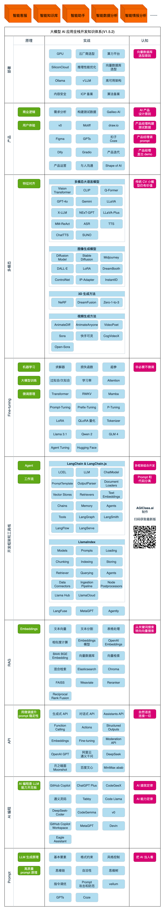
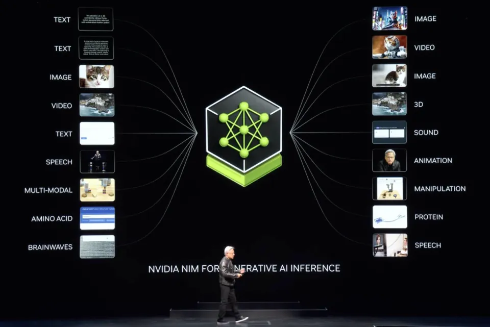

# 01 Intro   Index


# 大模型应用开发基础

## 迎接 AGI 时代

AGI（Artificial General Intelligence）中文译为「通用人工智能」。是具备超越人类智能的 AI。

实现 AGI 是所有 AI 核心厂商的共同目标。其他人的期望：

- 在过程中能抓住一些机会
- 在 AGI 到来后成为获益者

AGI 多久会到来？

- 乐观预测：明年
- 主流预测：3-5 年（OpenAI、DeepMind、NVIDIA 持此观点）
- 悲观预测：10 年

AGI 时代，AI 无处不在，形成新的社会分层：

1. **AI 产品使用者**，使用别人开发的 AI 产品
2. **AI 产品制造者**，设计和开发 AI 产品，哪怕只是满足自己的需求
3. **基础模型相关**，训练基础大模型，或为大模型提供基础设施（算力等）

越向下层，重要性越高，从业人数越少。

> ⚠️ **Note:** 思考：你想在哪一层？

本课程目标是帮你抢先成为 **AI 产品制造者**，因为：

1. 使用者人人都是，不稀缺
2. 基础模型相关门槛特别高，机会特别难遇到。比如：全球做基础大模型训练的，只需要不超过 2000 人

## AI 产品制造者的核心能力模型

三懂：

1. **懂业务**，就是懂用户、懂客户、懂需求、懂市场、懂运营、懂商业模式，**懂怎么赚钱**
2. **懂 AI**，就是懂 AI 能做什么，不能做什么，怎样才能做得更好、更快、更便宜，**懂怎么用 AI 解决赚钱过程中的问题**
3. **懂编程**，就是懂如何编写代码实现一个符合业务需求的产品，**尤其是 AI 产品**

争取三懂，至少两懂，无论如何要懂 AI。所以有三种人：

1. **AI 全栈工程师**：懂业务、懂 AI、懂编程
2. **业务向**：懂业务、懂 AI
3. **编程向**：懂编程、懂 AI

建议：

1. 编程向的，要尽可能靠近业务，争取全栈，否则走不远
2. 业务向的，试试学编程，自主性更强。AI 编程，门槛已经低多了（但绝不是没门槛）

学什么呢？在下图中找到自己的地盘。



## 怎样学好这门课

这门课的目标，是培养「AI 全栈」。

- 「全栈」涉及的知识面非常广，区区一门课不可能全部涉及
- 我们能做到的是，在各个方向上都为大家打开一扇门，带大家入门
- 想走得更深更远，要靠大家自己，我们的社群，和 AI 的进化。

「入门」并不等于简单、肤浅。我们的课程会在三个方向发力：

1. **原理**：不懂原理就不会举一反三，走不了太远。
2. **实践**：不懂实践就只能纸上谈兵，做事不落地。
3. **认知**：认知不高就无法做对决策，天花板太低。

这三样，都是「干货」。

> ✅ **Tip:** 强烈提醒！大模型时代，代码不再是干货！
目前，行业共识是：

确定未来 - AI 必然重构世界
确定进入 - 想收获红利，必须马上进入
落地关键在业务 - AI 相关的代码只是很薄的一层

## 学习取舍

课程大纲的内容，想 AI 全栈就都要学透。业务向和编程向的，可以有所取舍。

| 模块         | 课节                           | 业务向   | 编程向   | AI 全栈  |
| ------------ | ------------------------------ | -------- | -------- | -------- |
| 一、初阶应用 | 01 大模型应用开发基础          | **学透** | **学透** | **学透** |
|              | 02 Prompt Engineering          | **学透** | **学透** | **学透** |
|              | 03 Function Calling            | 了解     | **学透** | **学透** |
|              | 04 从 AI 编程认知 AI           | **学透** | **学透** | **学透** |
| 二、高阶应用 | 05 RAG 和 Embeddings           | 了解     | **学透** | **学透** |
|              | 06 Assistants API              | 了解     | 了解     | 了解     |
|              | 07 LlamaIndex                  | 熏陶     | **学透** | **学透** |
|              | 08 LangChain                   | 熏陶     | **学透** | **学透** |
|              | 09 LLM 应用开发工具链          | 了解     | **学透** | **学透** |
|              | 10 手撕 Agent 实现 AutoGPT     | 熏陶     | **学透** | **学透** |
|              | 11 工作流                      | 了解     | **学透** | **学透** |
| 三、模型训练 | 12 神经网络与 Transformer 详解 | 了解     | **学透** | **学透** |
|              | 13-14 模型微调                 | 熏陶     | **学透** | **学透** |
|              | 15 Agent 模型微调              | 熏陶     | **学透** | **学透** |
|              | 16-17 多模态大模型             | 了解     | **学透** | **学透** |
|              | 18 视觉生成模型                | 了解     | **学透** | **学透** |
| 四、商业闭环 | 19-20 AI 产品部署和交付        | 了解     | **学透** | **学透** |
|              | 21 大模型时代的创业机遇        | **学透** | 了解     | **学透** |
|              | 22 产品设计                    | **学透** | 了解     | **学透** |
|              | 23 产品运营                    | **学透** | 了解     | **学透** |
| 五、项目综合 | 24 技术方案咨询答疑            | 了解     | **学透** | **学透** |
|              | 25 优秀项目路演                | **学透** | **学透** | **学透** |

- 学习历程，就是一个 AI 应用从无到有、从简单到复杂、从研发到市场的过程
- 编程向，且对大模型了解较少的，课程获得感最强
- 编程向，但对大模型已经有一定了解的，学起来会轻松一些，但要关注信息增量
- 业务向，不调整好预期，学起来会很吃力

下面正式进入课程！

## 什么是 AI？


> ⚠️ **Note:** 思考：「智能冰箱」是 AI 吗？

一种观点：基于机器学习、神经网络的是 AI，基于规则、搜索的不是 AI。

## 大模型 AI 能干什么？

大模型，全称「大语言模型」，英文「Large Language Model」，缩写「LLM」。

现在，已经不需要再演示了。每人应该都至少和下面一个基于大模型的对话产品，对话过至少 100 次。

| 国家 | 公司      | 对话产品  | 旗舰大模型 | 网址                                                                   |
| ---- | --------- | --------- | ---------- | ---------------------------------------------------------------------- |
| 美国 | OpenAI    | ChatGPT   | GPT        | [https://chatgpt.com/](https://chatgpt.com/)                           |
| 美国 | Microsoft | Copilot   | GPT 和未知 | [https://copilot.microsoft.com/](https://copilot.microsoft.com/)       |
| 美国 | Google    | Gemini    | Gemini     | [https://gemini.google.com/](https://gemini.google.com/)               |
| 美国 | Anthropic | Claude    | Claude     | [https://claude.ai/](https://claude.ai/) ，公认不输甚至超过 GPT 的     |
| 中国 | 百度      | 文心一言  | 文心       | [https://yiyan.baidu.com/](https://yiyan.baidu.com/)                   |
| 中国 | 阿里云    | 通义千问  | 通义千问   | [https://tongyi.aliyun.com/qianwen](https://tongyi.aliyun.com/qianwen) |
| 中国 | 智谱 AI   | 智谱清言  | GLM        | [https://chatglm.cn/](https://chatglm.cn/)                             |
| 中国 | 月之暗面  | Kimi Chat | Moonshot   | [https://kimi.moonshot.cn/](https://kimi.moonshot.cn/)                 |
| 中国 | MiniMax   | 星野      | abab       | [https://www.xingyeai.com/](https://www.xingyeai.com/)                 |
| 中国 | 深度探索  | deepseek  | DeepSeek   | [https://chat.deepseek.com/](https://chat.deepseek.com/)               |

本课第一个专业向要求：分清**对话产品**和**大模型**。

> ⚠️ **Note:** 建议：

要有一个访问国外的「通道」，否则无法有顶级体验
如果不能访问 ChatGPT，不是 ChatGPT Plus 会员，会非常遗憾
Microsoft Copilot 是 ChatGPT 免费平替，用的也是宇宙最强 GPT-4o 大模型

但是，千万别以为大模型只是聊天机器人。它的能量，远不止于此。

### 按格式输出


### 分类


### 聚类


### 持续互动


### 技术相关问题


### 可能一切问题，都能解决，所以是通用人工智能 AGI

用 AI，要用「用人思维」：

- 机器思维：研发了什么功能，就有什么功能。
- 用人思维：给 ta 一个任务，总会有些反馈，或好或坏，惊喜或惊吓。

> ✅ **Tip:** 划重点：

大模型就是一个函数，给输入，生成输出任何可以用语言描述的问题，都可以输入文本给大模型，就能生成问题的结果文本 ，进而，任意数据，都可以输入给大模型，生成任意数据

英伟达 CEO 黄仁勋 2024 年 6 月 2 日在 Computex 上的演讲提到各种模态数据的统一支持：



## 大模型落地情况综述

《2024 年 9 月之大模型落地现状》

作者：孙志岗

```
Killer App 没有影，
AI 原生待证明。
手握场景不着急，
内部提效暗暗行。
```

注：2023 年 7 月，孙志岗就[预言了这种情况](https://mp.weixin.qq.com/s?__biz=MzAwNDk3NjUxMg==&mid=2247484056&idx=1&sn=492221e1f8039b3cd48a52c2b18b1f94&chksm=9b22f877ac557161fc606ad25eee4e661183bf076f2349a62f8bd99417c324cb801a6f896cad#rd)。

### Killer App 没有影

- AI 没有创造新的使用场景，只是旧场景的增强，所以没有 Killer App 的土壤
- 可以乐观期待 Killer App，但别苦苦追求
- 请忽略一切张嘴就是 Killer App 的人

### AI 原生待证明

**AI 原生**，是指产品的核心功能是 AI，而不是 AI 作为辅助功能。典型特点是，有 AI 后才出现。

- 助手类，打不过 Siri 们
  - [ChatGPT](https://chatgpt.com)
  - [Kimi Chat](https://kimi.moonshot.cn)
  - [文心一言](https://yiyan.baidu.com)
  - [通义千问](https://tongyi.aliyun.com/qianwen)
  - [智谱清言](https://chatglm.cn)
  - ……
- 搜索类，谷歌百度不会袖手旁观
  - [Perplexity](https://perplexity.ai)
  - [秘塔 AI](https://metaso.cn/)
  - [Devv](https://devv.ai/)
- 情感陪伴类，社交巨头正谨慎观察
  - [Character.AI](https://character.ai)（已被 Google 人才收购）
  - [星野](https://www.xingyeai.com/)
  - [Replika](https://replika.ai)
- 定制 Agent，基本已证明商业模式不成立
  - [ChatGPT GPTs](https://chatgpt.com/gpts)
  - [扣子](https://www.coze.cn)
  - [Dify](https://dify.ai)

### 手握场景不着急

大玩家毫不落后，AI 带来的市场格局变化不大。

- 拍照答题
  - [Gauth](https://www.gauthmath.com/)
  - [Question AI](https://www.questionai.com/)
- 英语学习
  - [多邻国](https://www.duolingo.cn/)
  - [有道 Hi Echo](https://hiecho.youdao.com/)
- 图像处理
  - [美图秀秀](https://xiuxiu.meitu.com/)
  - [Adobe Firefly](https://www.adobe.com/products/firefly.html)
- 办公
  - [WPS AI](https://ai.wps.cn/)
  - [Copilot for Microsoft 365](https://adoption.microsoft.com/en-us/copilot/)
  - [钉钉魔法棒](https://alidocs.dingtalk.com/i/p/Pl2AmoVbakq8Xdb9BpLmk7jYdkVEvm2g)
  - [飞书智能伙伴](https://www.feishu.cn/product/ai_companion)
  - [腾讯会议智能助手](https://meeting.tencent.com/ai/)
- 编程
  - [GitHub Copilot](https://github.com/features/copilot/)
- 全家桶
  - Google
  - Microsoft
  - 字节跳动

### 内部提效暗暗行

很多企业将大模型和业务相结合，取得了或大或小的效果

- 营销
  - AI 做营销创意，人再加工
  - AI 批量生产营销素材
  - 多语言翻译
- 客服/销售
  - 全 AI，适合本来没人做，AI 来补位
  - 半 AI，适合本来有人做，AI 来提效
- 办公
  - 公文撰写/总结/翻译
  - 知识库
    - 内部客服
    - 辅助决策
  - 情报分析
  - BI
- 产品研发
  - 创意、头脑风暴
  - IT 研发提效

## 怎样寻找落地方向

- 当下，阻碍大模型落地的最大障碍是没有形成认知对齐。

### 成功落地大模型五要素

来自公众号文章[《复盘大模型的一次成功落地，代替了百万年薪的人》](https://mp.weixin.qq.com/s?__biz=MzAwNDk3NjUxMg==&mid=2247484174&idx=1&sn=ce1bed131385fd9bf71bc9ffa3bd5592&chksm=9b22f9e1ac5570f721ac2480d7010607139aa7ba5d95a604be44d32c790fd911d2f91bc0e21c#rd)。将本文转给老板有奇效。

> ✅ **Tip:** 成功落地大模型五要素：

业务人员的积极
对 AI 能力的认知
业务团队自带编程能力
小处着手
老板的耐心

### 如何找到落地场景

> ✅ **Tip:** 找落地场景的思路：

从最熟悉的领域入手
尽量找能用语言描述的任务
别求大而全。将任务拆解，先解决小任务、小场景
让 AI 学最厉害员工的能力，再让 ta 辅助其他员工，实现降本增效

> ⚠️ **Note:** 思考：你的业务中，有哪些问题可能 AI 能解决？

### 工作机会在哪里？

首先要知道：纯大模型岗位几乎是不存在的。

可选：

1. 独立开发者/创业
2. 有科技属性的公司几乎所有岗位
3. 传统企业跑通 AI 工作流，找全栈工程师定制化开发

## 大模型是怎样工作的？

### 通俗原理

其实，它只是根据上文，猜下一个词（的概率）……


OpenAI 的接口名就叫「completion」，也证明了其只会「生成」的本质。

下面用程序演示「生成下一个字」。你可以自己修改 prompt 试试。还可以使用相同的 prompt 运行多次。

```python
from openai import OpenAI

from dotenv import load_dotenv, find_dotenv
_ = load_dotenv(find_dotenv())

client = OpenAI()

prompt = "今天我很"  # 改我试试
# prompt = "下班了，今天我很"
# prompt = "放学了，今天我很"
# prompt = "AGI 实现了，今天我很"
response = client.completions.create(
    model="gpt-3.5-turbo-instruct",
    prompt=prompt,
    max_tokens=512,
    stream=True
)

for chunk in response:
    print(chunk.choices[0].text, end='')
```

**Output:**
```
开心，
因为我很期待明天
明天是个全新的一天
有数不尽的可能性等着我
我可以充满激情地迎接新的挑战
我可以抓住每一次机会
让自己变得更强大
我可以满怀希望地面对未来
相信自己能够实现梦想
今天的快乐会成为明天的动力
让我更加勇敢地追求美好的生活
无论遇到什么困难
我都会坚持不懈
勇敢前行，努力奋斗
因为明天的希望就在前方
我相信明天会更加美好
所以今天，我感到无比幸福和满足。
```

### 略深一点的通俗原理

**训练**和**推理**是大模型工作的两个核心过程。

用人类比，训练就是学，推理就是用。学以致用，如是也。

例如，有下面训练数据：

1. AI 正在改变我们的生活方式。
2. **AI 技术在医疗领域有广泛应用。**
3. AI 可以提高企业的生产效率。
4. AI 算法能够预测市场趋势。
5. AI 在自动驾驶汽车中扮演重要角色。
6. AI 有助于个性化教育的发展。
7. AI 机器人可以执行复杂的任务。
8. **AI 技术正在推动智能家居的普及。**
9. AI 在金融分析中发挥着关键作用。
10. **AI 技术正逐步应用于艺术创作。**

「AI」之后出现「技」的概率大于其它字。这些字之间的概率关系，就是大模型训练时学到的。

用不严密但通俗的语言描述原理：

> ✅ **Tip:** 训练：
1、大模型阅读了人类说过的所有的话。这就是「机器学习」
2、训练过程会把不同 token 同时出现的概率存入「神经网络」文件。保存的数据就是「参数」，也叫「权重」

> ✅ **Tip:** 推理：
1、我们给推理程序若干 token，程序会加载大模型权重，算出概率最高的下一个 token 是什么
2、用生成的 token，再加上上文，就能继续生成下一个 token。以此类推，生成更多文字

Token 是什么？

1. 可能是一个英文单词，也可能是半个，三分之一个
2. 可能是一个中文词，或者一个汉字，也可能是半个汉字，甚至三分之一个汉字
3. 大模型在开训前，需要先训练一个 tokenizer 模型。它能把所有的文本，切成 token

> ⚠️ **Note:** 思考： 
> 1、AI 做对的事，怎么用这个原理解释？ 
> 2、AI 的幻觉，一本正经地胡说八道，怎么用这个原理解释？

### 再深一点点

- 这套生成机制的内核叫「Transformer 架构」
- Transformer 是目前人工智能领域最广泛流行的架构，被用在各个领域
- Transformer 仍是主流，但并不是最先进的

| 架构                     | 设计者                                               | 特点                                     | 链接                                                                                                   |
| ------------------------ | ---------------------------------------------------- | ---------------------------------------- | ------------------------------------------------------------------------------------------------------ |
| Transformer              | Google                                               | 最流行，几乎所有大模型都用它             | [OpenAI 的代码](https://github.com/openai/finetune-transformer-lm/blob/master/train.py)                |
| RWKV                     | [PENG Bo](https://www.zhihu.com/people/bopengbopeng) | 可并行训练，推理性能极佳，适合在端侧使用 | [官网](https://www.rwkv.com/)、[RWKV 5 训练代码](https://github.com/BlinkDL/RWKV-LM/tree/main/RWKV-v5) |
| Mamba                    | CMU & Princeton                                      | 性能更佳，尤其适合长文本生成             | [GitHub](https://github.com/state-spaces/mamba)                                                        |
| Test-Time Training (TTT) | Stanford, UC San Diego, UC Berkeley & Meta AI        | 速度更快，长上下文更佳                   | [GitHub](https://github.com/test-time-training)                                                        |

目前只有 transformer 被证明了符合 scaling-law。

更多细节，在模块三《模型训练》中展开。

## 用好 AI 的核心心法

OpenAI 首席科学家 Ilya Sutskever 说过：

> 数字神经网络和人脑的生物神经网络，在数学原理上是一样的。

所以，我们要：

> ✅ **Tip:** 
>
> 把 AI 当人看
> 把 AI 当人看
> 把 AI 当人看

凯文·凯利在和孙志岗交流时，说了类似的观点：「和人怎么相处，就和 AI 怎么相处。」

1. 用「当人看」来理解 AI
2. 用「当人看」来控制 AI
3. 用「当人看」来说服别人正确看待 AI 的不足

当什么人呢？

1. 学习时当老师
2. 工作时当助手
3. 休闲时当朋友

这是贯彻整门课的心法，乃至我们与 AI 相伴的人生的心法。

> ✅ **Tip:** 划重点：使用大模型，首先要建立对象感。你是什么角色？Ta 是什么角色？

> ⚠️ **Note:** 课堂实验：你提个 AI 相关问题，我来用人类比

## 大模型应用产品架构


Agent 模式还太超前，Copilot 是当前主流。

实现 Copilot 的主流架构是**多 Agent 工作流**

- 模仿人做事，将业务拆成工作流（workflow、SOP、pipeline）
- 每个 Agent 负责一个工作流节点

模块二《高阶应用》尾声会专门探讨工作流。

## 大模型应用技术架构

> ✅ **Tip:** 大模型应用技术特点：门槛低，天花板高。

### 纯 Prompt

- Prompt 是操作大模型的唯一接口
- 当人看：你说一句，ta 回一句，你再说一句，ta 再回一句……


#### Agent + Function Calling

- Agent：AI 主动提要求
- Function Calling：AI 要求执行某个函数
- 当人看：你问 ta「我明天去杭州出差，要带伞吗？」，ta 让你先看天气预报，你看了告诉 ta，ta 再告诉你要不要带伞


#### RAG（Retrieval-Augmented Generation）

- Embeddings：把文字转换为更易于相似度计算的编码。这种编码叫**向量**
- 向量数据库：把向量存起来，方便查找
- 向量搜索：根据输入向量，找到最相似的向量
- 当人看：考试答题时，到书上找相关内容，再结合题目组成答案，然后，就都忘了


#### Fine-tuning（精调/微调）

当人看：努力学习考试内容，长期记住，活学活用。


### 如何选择技术路线

面对一个需求，如何开始，如何选择技术方案？下面是个不严谨但常用思路。

其中最容易被忽略的，是**准备测试数据**


值得尝试 Fine-tuning 的情况：

1. 提高模型输出的稳定性
2. 用户量大，降低推理成本的意义很大
3. 提高大模型的生成速度
4. 需要私有部署

### 如何选择基础模型

凡是问「哪个大模型最好？」的，都是不懂的。

不妨反问：「有无论做什么，都表现最好的员工吗？」

> ✅ **Tip:** 划重点：没有最好的大模型，只有最适合的大模型

基础模型选型，合规和安全是首要考量因素。

| 需求             | 国外闭源大模型 | 国产闭源大模型 | 开源大模型 |
| ---------------- | -------------- | -------------- | ---------- |
| 国内 2C          | 🛑             | ✅             | ✅         |
| 国内 2G          | 🛑             | ✅             | ✅         |
| 国内 2B          | ✅             | ✅             | ✅         |
| 出海             | ✅             | ✅             | ✅         |
| 数据安全特别重要 | 🛑             | 🛑             | ✅         |

然后用测试数据，在可以选择的模型里，做测试，找出最合适的。

为什么不要依赖榜单？

- 榜单已被应试教育污染。唯一还算值得相信的榜单：[LMSYS Chatbot Arena Leaderboard](https://chat.lmsys.org/?leaderboard)
- 榜单体现的是整体能力。放到一件具体事情上，排名低的可能反倒更好
- 榜单体现不出成本差异

AI 全栈课程主要以 OpenAI 为例，少量介绍国产大模型，微调会用开源大模型。因为：

1. OpenAI 最流行，即便国内也是如此
2. OpenAI 最先进
3. 其它模型都在追赶和模仿 OpenAI
   - 学会 OpenAI，其它模型触类旁通
   - 反之，不一定

## 体验编程调用 OpenAI API

本课程主打语言是 Python，因为：

1. Python 和 AI 是天生一对
2. Python 是最容易学习的编程语言

### 安装 OpenAI Python 库

在命令行执行：

```bash
pip install --upgrade openai
```

### 发一条消息

体验给大模型注入新知识的代码竟如此简单。

```python
from openai import OpenAI

# 加载 .env 文件到环境变量
from dotenv import load_dotenv, find_dotenv
_ = load_dotenv(find_dotenv())

# 初始化 OpenAI 服务。会自动从环境变量加载 OPENAI_API_KEY 和 OPENAI_BASE_URL
client = OpenAI()

# 消息
messages = [
    {
        "role": "system",
        "content": "你是AI助手小瓜，是 AGIClass.ai 的助教。这门课每周二、四上课。"  # 注入新知识
    },
    {
        "role": "user",
        "content": "周末上课吗？"  # 问问题。可以改改试试
    },

]

# 调用 GPT-4o-mini 模型
chat_completion = client.chat.completions.create(
    model="gpt-4o-mini",
    messages=messages
)

# 输出回复
print(chat_completion.choices[0].message.content)
```

**Output:**
```
不，上课安排在每周二和周四。周末没有课程安排。
```