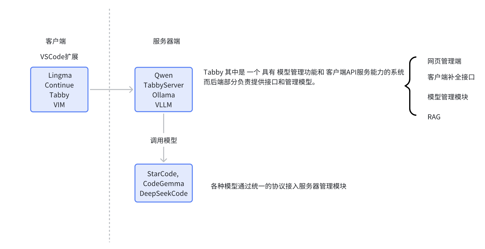
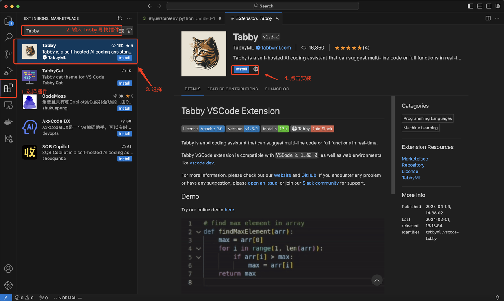
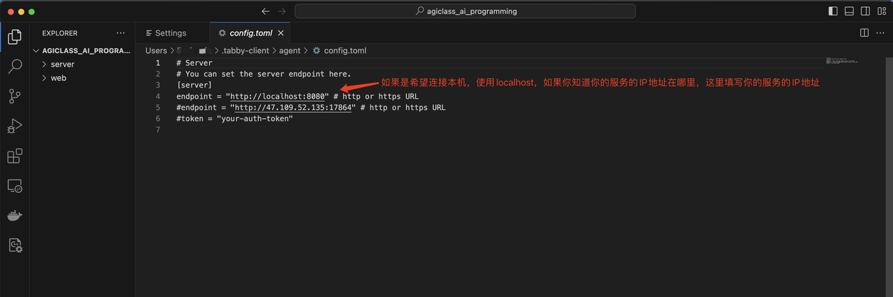
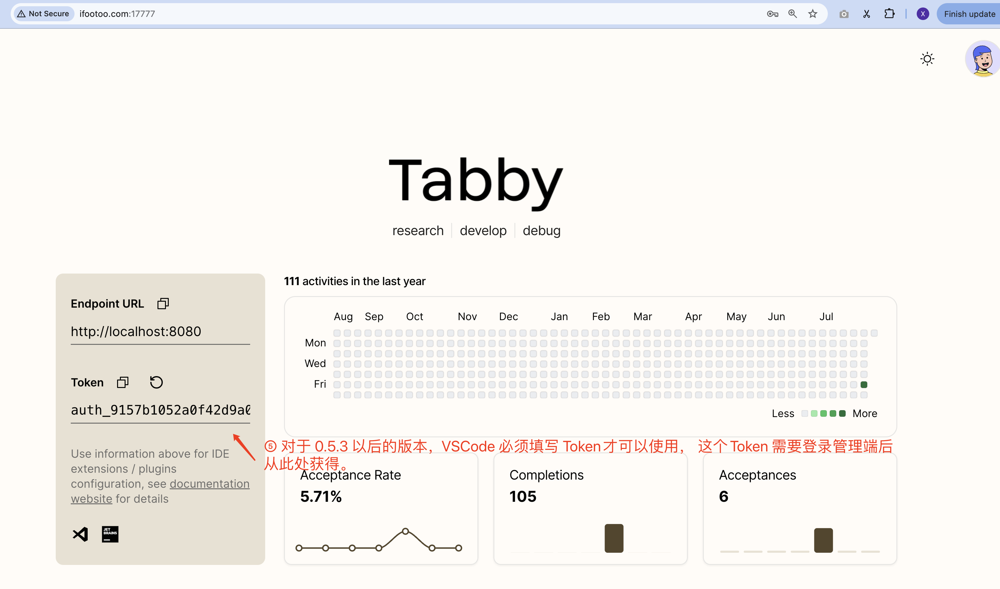
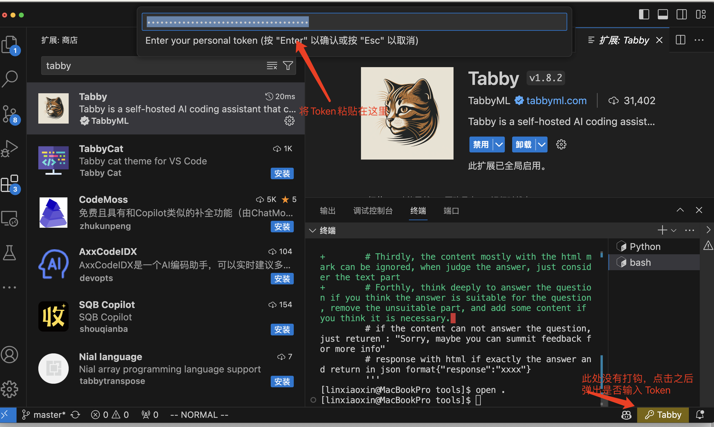
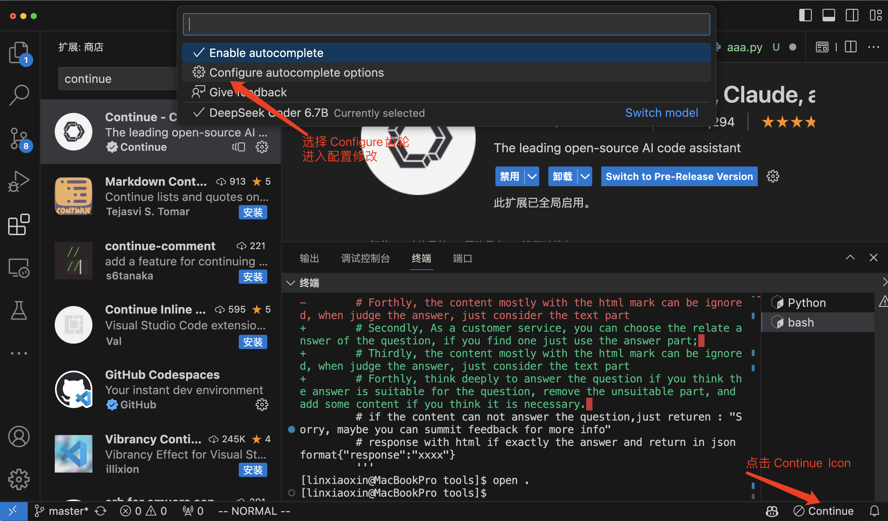
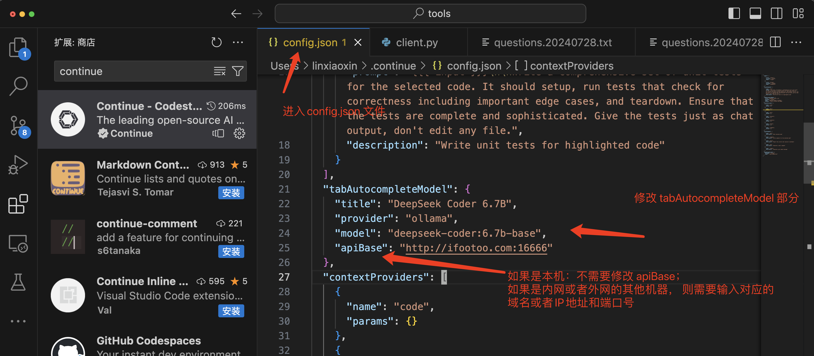

# Practice   Index


# AI编程工具与演示

## 💡 这节课会带给你

1. 了解AI编程需要的工具
2. 自己搭建一套Copilot
3. 学会用AI编程

> ✅ **Tip:** 当你关闭视频的时候，可以自信的说，我会用AI编程了

# 前置软件安装

> ⚠️ **Note:** 上课要求：必须使用电脑

## Python

- 官方网页：
  - https://www.python.org/
  - 推荐版本：Python 3.11

## Cursor
* 官网网页
  - https://www.cursor.com/

## Visual Studio Code (简称 VS Code)

- 官方网页：
  - https://code.visualstudio.com/
- VSCode Python插件
  - https://marketplace.visualstudio.com/items?itemName=ms-python.python
  - 解释：Python插件不是Python脚本解析器，是VSCode编辑器在编写Python脚本的时候，做语法检测、Debug调用的时候的小工具

# AI编程工具

## TONGYI Lingma
- 官方地址： https://tongyi.aliyun.com/lingma
- 通义灵码是阿里开发的支持 VSCode的的服务。
- 收费情况：个人免费、企业版本收费
- 模型服务：阿里提供代码生成模型服务
- 便捷度：高 （用户只需要在VSCode中安装即可）
- 插件安装地址：https://marketplace.visualstudio.com/items?itemName=Alibaba-Cloud.tongyi-lingma

## 安装过程
1. 在VSCode中查找"TONGYI Lingma"
   


2. 安装成功后，注册阿里云账号，登录TONGYI Lingma
   


3. 登录成功显示


4. 新建文件，进入文件开始使用


## 其他工具推荐
### CodeGeex 
- 官方网页：https://codegeex.cn/
- VSCode插件安装地址: https://marketplace.visualstudio.com/items?itemName=aminer.codegeex 
- 收费情况：目前免费
- 制造商：智谱

### Comate
- 官方网页： https://comate.baidu.com/
- VSCode插件安装地址： https://marketplace.visualstudio.com/items?itemName=BaiduComate.comate
- 收费情况：免费
- 制造商：百度

> ⚠️ **Note:** 注意：安装插件有两种方式：可以在VSCode的扩展中搜索安装，也可以点击上面的插件地址安装

## Github Copilot

### 注意点
- 登录：使用github的账号在 Cursor 中登录 
- 快捷键： Cmd + I / Ctrl + I

# 搭建一个完全离线开源 AI 编程助手

## 架构图



使用本地化方案由3部分组成
- 编辑器上的插件
- 链接插件和模型的管理服务，类似：Tabby、Ollama、VLLM等
- 代码生成模型

## Tabby
### Tabby介绍
- 官方网页：https://tabby.tabbyml.com/
- 如何安装：https://tabby.tabbyml.com/docs/quick-start/installation/apple/
- 详细安装过程： https://agiclass.feishu.cn/docx/ClrVddclboshICxgMmgcOggMnU3#HMR6dsJe5olNE1xpPGKcS9t4n0e

以下是部分内容，大家以以上的详细内容为主

### Mac电脑安装

1. 第一步：安装本地模型

```bash
brew install tabbyml/tabby/tabby

# Start server with StarCoder-1B
tabby serve --device metal --model TabbyML/StarCoder-1B # 这里的模型可以根据你的环境和内存替换成你真实需要的模型
```

2. 第二步：安装客户端，这里以VSCode为例
- 在VSCode中安装插件
  


- 查看状态


- 修改配置


- 设置本地服务



#### Tabby 版本的问题
- Tabby 目前还是在高速的开发迭代中，所以版本兼容需要测试，如果你安装不成功，未必是你的问题
- Tabby 在0.5.2 以前的版本是不需要登录，也不需要token就可以正常使用的

#### Tabby 根据不同版本安装

- Docker 安装

    ```
    docker pull tabbyml/tabby:0.5.2 #大家可以更具需要选择版本，低版本使用不了新模型
    sudo docker run -it --gpus all -p 8080:8080 -v $HOME/.tabby:/data tabbyml/tabby:0.5.2 serve --model TabbyML/DeepseekCoder-6.7B --device cuda
    ```

- 命令行安装
  - 直接到github上选择指定的版本下载
  - https://github.com/TabbyML/tabby/releases 

  

- 源码自行编译
  - ```git clone https://github.com/TabbyML/tabby.git```
  - Tabby 使用Rust作为后台管理，对于熟悉Rust的同学可以用Rust进行编译

- 对于0.5.3 以后得版本的特殊说明
  - 如何获得Token 
    
  

  * 注意：这里的URL地址是你自己启动的 tabby 后端服务的地址
  
  - 如何填写Token
  
  

## Continue + Ollama方案

本方案的客户端和服务端分别由两个开源项目组成，客户端是 Continue，服务端是 Ollama

### Ollama
- 官方网页： https://ollama.com/ (因为模型本地化部署后续课程有详细介绍，这里不展开）
- 开源地址： https://github.com/ollama/ollama
- 操作系统： Windows、Linux、Mac
- 操作命令流程：(以Linux为例）
```bash
$ curl -fsSL https://ollama.com/install.sh | sh  # 安装 Ollama管理端 
$ export OLLAMA_HOST=0.0.0.0  # 如果希望服务可以被非本机的人访问
$ ollama serve
$ ollama run llama3.1 #通过 Ollama 启动模型 这里我们可以用 llama3.1 用于chat对话
$ ollama run deepseek-coder:6.7b-base  # 使用 deepseek-coder 作为编码生成模型
```
自此Ollama启动结束

- 关于Ollama的架构、原理、本地化模型部署，在后面的课程都会详细讲解，这里大家简单了解即可
- 更多参考资料 https://ollama.com/blog/continue-code-assistant

### Continue 
- 官方网页： https://www.continue.dev/
- 支持平台： VS Code 和 JetBrains
- VS扩展安装地址： https://marketplace.visualstudio.com/items?itemName=Continue.continue
- 支持自定义配置后端模型和地址
具体的操作步骤如下

1. 安装Continue


2. 打开配置



3. 设置对应的服务



配置JSON

```
  "tabAutocompleteModel": {
    "title": "DeepSeek Coder 6.7B", 
    "provider": "ollama",
    "model": "deepseek-coder:6.7b-base", # Ollama启动的模型
    "apiBase": "http://ifootoo.com:16666" # Ollama启动的服务地址
  }
```

自此，基于Ollama + Continue的 编码 Copilot安装完成，可以在本地的客户端编写代码，可以像使用Lingma一样编程了。

# Cursor 编程
- 设置
- 快捷键： Cmd + K / Cmd + L

# 使用AI编程

## 任务
- 需求：制作一个简单的客服机器人

## 操作
使用Python实现一个调用 Claude3.5 的服务、使用React或者Vue实现问答前端

### 后端 （提示词列表）
```
1. 我是个小白，我需要制作一个简单的客服机器人 ，你有什么建议
2. 如果我是个小白程序员，我怎么样规划这个客服机器人的架构呢？
3. 我是小白程序员，那么这个问答的后端应该怎么设计？
4. 那我选择 Flask这个架构，如何写这个后端，请直接出python的实现，我在mac 电脑上，请告诉我，怎么一步一步让这个代码运行起来。
5. bash: /usr/local/bin/flask: /usr/local/opt/python@3.10/bin/python3.10: bad interpreter: No such file or directory
6. GET 和 POST 到底是什么，应该怎么理解
7. Access to fetch at 'http://127.0.0.1:5000/query' from origin 'http://localhost:8081' has been blocked by CORS policy: Response to preflight request doesn't pass access control check: No 'Access-Control-Allow-Origin' header is present on the requested resource. If an opaque response serves your needs, set the request's mode to 'no-cors' to fetch the resource with CORS disabled.  flask 如何解决这个问题，请给出具体的修改方案
8. 如果我想部署到云端，应该怎么弄？
9.
    from flask import Flask, request, jsonify
    from flask_cors import CORS
    app = Flask(__name__)
    CORS(app)  # 应用CORS到所有路由
    
    
    # 导入依赖库
    from openai import OpenAI
    from dotenv import load_dotenv, find_dotenv
    
    # 加载 .env 文件中定义的环境变量
    _ = load_dotenv(find_dotenv())
    
    # 初始化 OpenAI 客户端
    client = OpenAI()  # 默认使用环境变量中的 OPENAI_API_KEY 和 OPENAI_BASE_URL
    
    # 示例问答数据，用于模拟简单的问答逻辑
    faq_data = {
        "what is your name": "My name is Bot.",
        "how are you": "I am fine, thank you!",
    }
    
    # 基于 prompt 生成文本
    # 默认使用 gpt-4o-mini 模型
    def get_completion(prompt, response_format="text", model="gpt-4o-mini"):
        messages = [{"role": "user", "content": prompt}]    # 将 prompt 作为用户输入
        response = client.chat.completions.create(
            model=model,
            messages=messages,
            temperature=0.7,                                  # 模型输出的随机性，0 表示随机性最小
            # 返回消息的格式，text 或 json_object
            response_format={"type": response_format},
        )
        return response.choices[0].message.content          # 返回模型生成的文本
    
    
    @app.route('/query', methods=['POST'])
    def answer_query():
        data = request.json  # 获取JSON请求数据
        user_query = data.get("query").lower().strip()  # 提取用户问题并格式化
        # 根据用户问题在FAQ数据中查找答案
    
        answer = get_completion(user_query)  # 调用 get_completion 函数生成文本
        #answer = faq_data.get(user_query, "Sorry, I do not understand the question.")
        return jsonify({'answer': answer})
    
    if __name__ == '__main__':
        app.run(debug=True)
# 在调试模式下运行应用  根据以上代码，如何添加历史记录保存和读取，包括数据库设计

10. 如何添加一个接口，让这个openai 的接口请求本地的Ollama 大模型 
11. 如何用阿里云部署这个客服程序，请给出详细的步骤
```

- 完整的问答对话全文： https://chatgpt.com/share/dad50d7d-6f6a-4657-b2bd-80c3847ff6fb

### 前端
```
1. 我是小白程序员，我需要实现一个简单的客户对话窗口，你觉得客服窗口应该是啥样的？
2. 能否画一个前端试试
3. 我是个前端的小白，如何实现上面的UI，有什么框架可以使用
4. 如果选择Vue的框架，如何实现，请给出具体的步骤
5. 我们要访问的 api 如下url = "http://127.0.0.1:5000/query"
    payload = json.dumps({
      "query": "what is your name"
    })
    headers = {
      'Content-Type': 'application/json'
    }   如何将 前端的输入和后端的请求对上

6. {
    "answer": "I’m called ChatGPT. How can I assist you today?"
}  返回的结果如上，需要前端做解析

```
因为有图的原因，前端的全文无法共享。截图放置在8期的飞书网页上。

## 本地编写一个Qt程序
提示词

```
1. 请用PyQt 写一个计算器， 上面是显示部分，下面是1-9，还有加减乘除和等号，请给出具体的代码和执行步骤
2. NameError: name 'Qt' is not defined
3. from PyQt5.QtWidgets import QApplication, QWidget, QVBoxLayout, QHBoxLayout, QPushButton, QLineEdit  这行代码什么意思，给我详细的解释
```
问答全文链接 https://chatgpt.com/share/ec05657c-b08d-49f7-9c6c-5ff4f723115c

# 本期代码

# 往期内容参考
- [5 期：AI 编程工具与演示笔记](https://agiclass.feishu.cn/docx/ClrVddclboshICxgMmgcOggMnU3)
- [6 期：AI 编程工具与演示笔记](https://agiclass.feishu.cn/docx/FQG5dbeCqo4UjAxXKgucrWmgn9f)
- [7 期：AI 编程工具与演示笔记](https://agiclass.feishu.cn/docx/CVSSdwjctonP6QxRraocBRSpnkg)
- [8 期：AI 编程工具与演示笔记](https://agiclass.feishu.cn/docx/ScE4dmmRpo3gSSxfO5OcJDXsnoc)