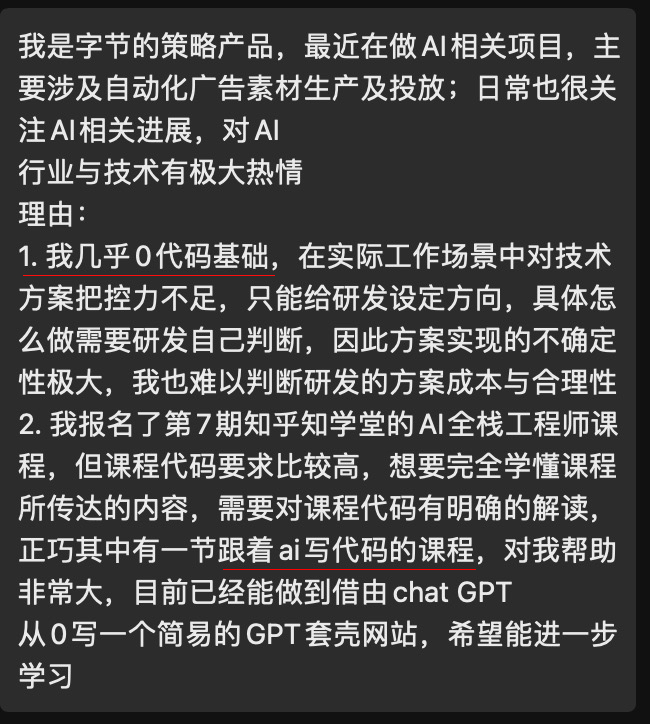

# 04 Ai Programming   Index


# 从 AI 编程认知 AI

## 💡 这节课会带给你

1. 通过 AI 编程，洞察 AI 的能力本质
2. 学习成熟的 AI 产品设计经验
3. 了解 AI 编程的原理，触类旁通其它应用场景
4. 编程新手：了解十倍提升学习、编码效率的工具（另赠送实操课）

开始上课！

## 认知 AI 最好的方式，是天天用

问自己两个问题：

1. 我时间都消耗在哪里？
2. 怎么让 AI 帮我省时间？

> ✅ **Tip:** 划重点：

凡是重复脑力劳动都可以考虑 AI 化
凡是「输入和输出都是文本」的场景，都值得尝试用大模型提效

### 场景

其中在软件开发过程中，已验证能明确提效（非代替人）的场景：

<table border="1" align="left">
    <thead>
        <tr>
            <th>阶段</th>
            <th>相关岗位</th>
            <th>活动</th>
        </tr>
    </thead>
    <tbody>
        <tr>
            <td rowspan="2">市场调研</td>
            <td>市场分析师</td>
            <td>市场调研</td>
        </tr>
        <tr>
            <td>技术经理</td>
            <td>技术选型</td>
        </tr>
        <tr>
            <td rowspan="3">需求分析</td>
            <td>产品经理</td>
            <td>需求分析</td>
        </tr>
        <tr>
            <td>产品经理</td>
            <td>PRD 撰写</td>
        </tr>
        <tr>
            <td>产品经理</td>
            <td>产品：写用户故事</td>
        </tr>
        <tr>
            <td rowspan="4">设计</td>
            <td>UI/UX 设计师</td>
            <td>图形元素绘制</td>
        </tr>
        <tr>
            <td>前端开发工程师</td>
            <td>从设计图生成代码</td>
        </tr>
        <tr>
            <td>前端/后端开发工程师</td>
            <td>API 文档调用</td>
        </tr>
        <tr>
            <td>系统架构师</td>
            <td>协议解析</td>
        </tr>
        <tr>
            <td rowspan="5">开发</td>
            <td>软件开发工程师</td>
            <td>从需求文本生成代码</td>
        </tr>
        <tr>
            <td>软件开发工程师</td>
            <td>代码审查</td>
        </tr>
        <tr>
            <td>软件开发工程师</td>
            <td>跨语言迁移：将 go 工程迁移成 Java 工程</td>
        </tr>
        <tr>
            <td>软件开发工程师</td>
            <td>解读遗留代码</td>
        </tr>
        <tr>
            <td>软件测试工程师</td>
            <td>编写测试用例</td>
        </tr>
        <tr>
            <td>运维</td>
            <td>运维工程师</td>
            <td>运维</td>
        </tr>
    </tbody>
</table>

还能显著提效的场景：撰写标书、营销文案、宣传图片、LOGO、商标等等周边场景

### 编程开发场景

先来看两个例子

- AI 编程提效案例一：


- AI 编程提效案例二：

一期会员产品匠人管子的「小蒜头学习工具箱」：https://agiclass.feishu.cn/docx/M5xydPVjWovB9exHBjDc7IMYnub#ONFUdZ4cGoziJexpRkscLhYUnUd

- AI 编程从不会到会的案例三：

  
- AI 编程在企业中的应用：


方法可以简化成一句话：**用 ChatGPT 4, Claude-3.5** 。

### 使用技巧

- 所有 prompt engineering 的技巧都有效，可以把**代码**、**错误信息**、**环境信息**直接粘贴进去
- 任何技术相关的问题都可以问，比自己搜索效率高很多
- 注意每次问答上下文窗口的大小

参考：

- [ChatALL](https://chatall.ai) 大量依赖 GPT-4
- 过程实录：https://chat.openai.com/share/ecfafa99-aaad-4432-a40c-81c261376758 （对话轮次非常多，加载慢，所以经常 404）
- 如果打不开，不需要到群里问，看[这个图](./assets/04-ai-programming/gpt-4-chatall.png)吧

但是，落到**写代码**这件事，还有更好的工具。

## 如何理解 AI 能编写程序

**编程能力是大模型各项能力的天花板**

- 「编程」是目前大模型能力最强的垂直领域，甚至超越了对「自然语言」本身的处理能力。因为：

  - 训练数据质量高
  - 结果可衡量
  - 编程语言无二义性
    
### 相关资料
  - 有[论文](https://arxiv.org/pdf/2211.09110.pdf)证明编程训练能增强模型的推理能力，所以会特别着意训练 (code-davinci002)
    - “The first model that OpenAI gave us was a Python-only model,” Ziegler remembers. “Next we were delivered a JavaScript model and a multilingual model, and it turned out that the Javascript model had particular problems that the multilingual model did not. It actually came as a surprise to us that the multilingual model could perform so well. But each time, the models were just getting better and better, which was really exciting for GitHub Copilot’s progress.” --[Inside GitHub: Working with the LLMs behind GitHub Copilot](https://github.blog/2023-05-17-inside-github-working-with-the-llms-behind-github-copilot/)
    - 思考：编程语言是字面意思(literal meaning)相关的么？

- 知道怎么用好 AI 编程，了解它的能力边界、使用场景，就能类比出在其他领域 AI 怎么落地，能力上限在哪
  - 此观点是我们原创，在分享过数次后，GitHub 官方发了一篇文章：[How to build an enterprise LLM application: Lessons from GitHub Copilot](https://github.blog/2023-09-06-how-to-build-an-enterprise-llm-application-lessons-from-github-copilot/)。当然，这只是巧合。(这篇文章描述了 GitHub Copilot 的产品打造哲学，非常推荐。)

所以：

> ✅ **Tip:** 划重点：

    使用 AI 编程，除了解决编程问题以外，更重要是形成对 AI 的正确认知。
    数据质量决定 AI 的质量。

### Copilot 的几个含义


> ⚠️ **Note:** 容易混淆的概念

    Microsoft Copilot：微软的一系列产品，从 Office、Windows、Edge 到 Bing 搜索都标配 
    GitHub Copilot：GitHub 平台和 OpenAI 合作的编程助手
    AI Copilot：产品范式

## GitHub Copilot 介绍

[GitHub Copilot](https://github.com/features/copilot) 创造了一个奇迹：

**所有竞争对手（Amazon、Google、Meta、阿里巴巴、腾讯等）都是免费的，每月 10-20 美元的 Copilot 仍市占率最高。**

不使用它只有一个理由：保密自己的代码。

这是一个能提升**幸福感**的工具，随时都有 Aha! 时刻。

几个事实：

- 2021 年 6 月上线，比 ChatGPT 早近一年半
- GitHub 统计：
  - 88% 的用户获得效率提升
  - 平均 46% 的代码由它完成
  - 平均效率提升 55%（网易内部统计 38%，根据需求燃尽图和速度统计得知）
- AGI 课堂调研试用到付费转化率：69%
- 个人版 10 美元/月，商业版 19 美元/月，企业版 39 美元/月 （打通你的 GitHub 代码库 [Copilot Plan](https://github.com/features/copilot/plans))

### 安装

1. 首先，需要有 GitHub 账号
2. 然后，到 https://github.com/settings/copilot 启用
3. 最后，安装 IDE 插件，比如
   - VSCode: https://marketplace.visualstudio.com/items?itemName=GitHub.copilot
   - PyCharm: https://plugins.jetbrains.com/plugin/17718-github-copilot
   - Xcode : https://github.com/intitni/CopilotForXcode

注意：要全局科学上网才能正常使用

### 刷刷写代码

Copilot 的使用其实不需要学习……正常写代码，就会收获不断的惊喜。

它根据上下文，自动生成建议代码。如果觉得合适，按下 tab 就行了。比如：

#### 完成整个函数


#### 写测试用例


#### 根据注释写代码


但这种用法不太推荐，因为注释里针对 AI 而写的 prompt，并不适合人类阅读。

如果想从需求生成代码，更推荐后面介绍的「Copilot Chat」 或者直接使用 ChatGPT 4 问答

#### 一些技巧

1. 代码有了，再写注释，更省力
2. 改写当前代码，可另起一块新写，AI 补全得更准，完成后再删旧代码
3. `Cmd/Ctrl + →` 只接受一个 token
4. 如果有旧代码希望被参考，就把代码文件在新 tab 页里打开

### GitHub Copilot Chat

- 背后是 GPT-4o

官方使用演示：修复一个函数的 Bug

<video src="Copilot-Chat-Debug-Blog.mp4" controls="controls" width="100%" height="auto" preload="none"></video>

敲「/」可以看到特殊指令：


VS 中选中要操作的代码，或者光标停留在想插入代码的地方，按 `Cmd/Ctrl + i`，可以内嵌呼出 Copilot chat：

<video src="CopilotChatVSInlineRefinement.mp4" controls="controls" width="100%" height="auto" preload="none"></video>

### 命令行的 Copilot

* 先要安装 GitHub CLI：https://cli.github.com/

* !第一次使用需要命令行登录: https://github.com/github/gh-copilot
```
gh auth login --web -h github.com #登录
gh extension install github/gh-copilot --force #升级
```

* 然后：

```bash
gh copilot suggest 怎样把 python 的 openai 库升级到最新
gh copilot explain "rm -rf /*"
```

### 生成 git commit message

猜猜入口在哪？

### GitHub Copilot Extensions

[官方介绍 blog](https://github.blog/2024-05-21-introducing-github-copilot-extensions/)

把 Copilot Chat 扩展成一套多 agent 的系统：

1. 每个 extension 专注做自己最擅长的事情，并自带用户的数据
2. 在 Copilot Chat 中，通过 @ 的动作把 agent 串联，就像一场专家会诊
3. 可以开发自己的 private extension


> ✅ **Tip:** 产品设计经验：在 chat 界面里用 @ 串联多个 agent 是一个常见的 AI 产品设计范式。

### 一些其它使用方式

[10 unexpected ways to use GitHub Copilot](https://github.blog/2024-01-22-10-unexpected-ways-to-use-github-copilot/)

### 故事线

- 一个小转折：Copilot 从最开始的只用问答，到取消问答使用补全，到恢复问答。

> ✅ **Tip:** 产品设计经验：让 AI 在不影响用户原有工作习惯的情况下切入使用场景，接受度最高。

## GitHub Copilot 基本原理

### 工作原理

- 模型层：最初使用 OpenAI Codex 模型，它也是 GPT-3.5、GPT-4 的「一部分」。最新支持模型 GTP-4o。

- 应用层： prompt engineering。Prompt 中包含：

  1. 组织上下文：光标前和光标后的代码片段
  2. 获取代码片段：其它相关代码片段。当前文件和其它打开的同语言文件 tab 里的代码被切成每个 60 行的片段，用 [Jaccard 相似度](https://zh.wikipedia.org/wiki/%E9%9B%85%E5%8D%A1%E5%B0%94%E6%8C%87%E6%95%B0)评分，取高分的
     - 为什么是打开的 tabs？
     - 多少个 tabs 是有效的呢？经验选择：20 个
  3. 修饰相关上下文：被取用的代码片段的路径。用注释的方式插入，例如：`# filepath: foo/bar.py`，或者 `// filepath: foo.bar.js`
  4. 优先级：根据一些代码常识判断补全输入内容的优先级
  5. 补全格式：在函数定义、类定义、if-else 等之后，会补全整段代码，其它时候只补全当前行

  

- 数据流
  

- 有效性：

  - Telemetry(远程遥测[如何取消](https://docs.github.com/en/site-policy/privacy-policies/github-general-privacy-statement))

  - A/B Test

  - 智谱的度量方式

    

> ⚠️ **Note:** 思考：似乎Github Copilot 在Android Studio等IDE中没有Visual Studio Code好用？

### 了解更多

- [Inside GitHub: Working with the LLMs behind GitHub Copilot](https://github.blog/2023-05-17-inside-github-working-with-the-llms-behind-github-copilot/)
- [How GitHub Copilot is getting better at understanding your code](https://github.blog/2023-05-17-how-github-copilot-is-getting-better-at-understanding-your-code/)
- [A developer’s guide to prompt engineering and LLMs](https://github.blog/2023-07-17-prompt-engineering-guide-generative-ai-llms/)
- [GitHub Copilot VSCode Extension 逆向工程](https://zhuanlan.zhihu.com/p/639993637)
- [GitHub Copilot 深度剖析](https://xie.infoq.cn/article/06aabd93dc757a1015def6857)

## Cursor
### 公司介绍
* 官网： https://www.cursor.com/
* 创始人：Aman Sanger, Arvid Lunnemark, Sualeh Asif and Michael Truell
* 创建时间：2021年
* 估值： 种子轮-800万美金   A轮-6000美金
* 价格： 爱好者-2周免费   专业-20美元/月  商业版-40美元/月

### Cursor 和 Copilot的区别
* Cursor 是基于 VS Code 的开源版本开发的客户端； Copilot 是 VS Code 的扩展（插件）
* Cursor 支持多个模型； Copilot 只能用 GPT-4o

> ✅ **Tip:** 结论：Cursor 可以兼容 Copilot，所以使用 Cursor就可以了

### Cursor功能介绍
1. 聊天

<video src="videos/cursor/chat.mp4" controls="controls" width="80%" height="auto" preload="none"></video>

2. 对比

<video src="videos/cursor/cmdkloop2.mp4" controls="controls" width="80%" height="auto" preload="none"></video>

3. 光标预测

<video src="videos/cursor/cpp-full-video.mp4" controls="controls" width="80%" height="auto" preload="none"></video>

4. 多行编辑
5. 截图修复
6. 全工程搜索

### 值得关注功能
1. Diff
2. Apply
3. Cmd/Ctrl + L  &  Cmd/Ctrl + K

### 相关技术原理【猜测】
#### 技术点1：提高GPT3.5的编码能力
- 先用 GPT4 生成一份 PR 草稿，再用 GPT-3.5 去修复这个草稿中的 diff，再用 3.5 处理修改的内容。 
 
#### 技术点2：Differentiable Search Index
- 利用可微分索引 提高对文档的精准查找和关联


#### 技术点3：Plan Search


### 相关文档
1. https://mp.weixin.qq.com/s/QWy3hFjsseBaCgEMzOtGRA
2. https://hub.baai.ac.cn/view/39681
3. https://mp.weixin.qq.com/s/iM2GwTj4vaOqKR_5WkvNkA
4. [Planning In Natural Language Improves
LLM Search For Code Generation](https://arxiv.org/pdf/2409.03733)
5. [Transformer Memory as a
Differentiable Search Index](https://arxiv.org/pdf/2202.06991)

> ✅ **Tip:** 结论1：推荐使用Cursor 
结论2：对用户的交互的深入理解是做好 AI 产品的关键

## 还有哪些工具
1. [Tongyi Lingma](https://tongyi.aliyun.com/lingma) -- (插件+模型) 代码补全，免费。阿里云相关。
2. [CodeGeeX](https://codegeex.cn/) -- (插件+模型)清华智谱制造，CodeGeeX 3 Pro 免费可用
3. [Comate](https://comate.baidu.com/zh) -- （插件+模型）百度制造，有免费试用版
4. [MarsCode](https://www.marscode.cn/) -- (插件+ 模型+ 云平台）字节出品
5. [Bito](https://bito.ai/) - （插件）比 Copilot 还多些创新
6. [DevChat](https://www.devchat.ai/) -- （插件) 前端开源，同时卖 GPT 服务
7. [Tabnine](https://www.tabnine.com/) - (插件 + 模型) 代码补全，个人基础版免费
8. [Amazon CodeWhisperer](https://aws.amazon.com/codewhisperer/) - （模型） 代码补全，免费。AWS 相关的编程能力卓越。其它凑合
9. [Zed AI](https://zed.dev/) - （客户端） 开源的可以多人合作，并且支持 Copilot 的编辑器
10. [ell](https://github.com/MadcowD/ell) - （客户端） 提出理念，认为提示词也是代码的一部分，对提示词进行版本跟踪

## AI 编程有效性度量

### 网易

- 通过项目完成量和完成度统计
- 燃尽图


### DevChat

</img>

> ✅ **Tip:** 落地经验：只有可量化的结果，才能说服老板买单

## 部署自己的 AI 编程工具


### Ollama + Continue 
- Ollama: https://ollama.com/

- Continue: https://www.continue.dev/

### 可本机部署的 Tabby

Tabby：https://tabby.tabbyml.com/

- 全开源
- 可以本机部署，也可以独立本地部署
- 支持所有开源编程模型

### 更多开源编程大模型

1. [Code Llama](https://ai.meta.com/blog/code-llama-large-language-model-coding/) - Meta 出品，可能是开源中最强的 （7B、13B、34B、70B）
2. [DeepSeek-Coder](https://github.com/deepseek-ai/DeepSeek-Coder) - 深度探索公司出品（1B、5.7B、6.7B、33B）
3. [CodeGemma](https://huggingface.co/blog/codegemma) - Google 出品（2B、7B）

## AI 编程的强 Agent 尝试——一些自动编写代码的机器人

前面的工具都是帮你编程，而 Agent 是完全代替你编程。甚至做更多……

警告：以下介绍的现在都只能玩玩、做技术探讨，还远没到实用的程度。

### MetaGPT：多智能体元编程框架

https://github.com/geekan/MetaGPT

它不只写代码，而且写文档、画图。详见讲座课里 MetaGPT 核心工程师的分享。

核心 prompts：https://github.com/geekan/MetaGPT/tree/main/metagpt/prompts

评价：

- 让 agent 模拟岗位这个思路挺有意思。未来的公司就是人和 agent 混合的，这样的系统架构更匹配公司治理
- 所以 MetaGPT 其实是个多 Agent 开发框架，而不是单纯的编程工具

### GPT Engineer

https://github.com/AntonOsika/gpt-engineer

指定您想要它构建的内容，AI 会要求澄清，然后构建它。

只需三步操作：

```bash
pip install gpt-engineer
vim prompt
gpt-engineer .
```

核心 prompts：https://github.com/AntonOsika/gpt-engineer/tree/main/gpt_engineer/preprompts

一句话评价：什么都能干，所以还什么都干不好。

有个专门开发 Web App 的，可用性好一些：https://gptengineer.app/

### Devin

主页：https://www.cognition-labs.com/introducing-devin

一句话评价：还在内测，存在争议

### GitHub Copilot Workspace

主页：https://githubnext.com/projects/copilot-workspace

技术预览版，申请使用权需要排队

工作流程：

1. 从 issue 出发，在 issue 的上下文里工作
2. 分析 issue，形成计划，人工调整、确认
3. 执行计划，生成代码
4. 人工审核、修改代码后，直接提 pull request

### v0

主页：https://v0.dev/

提需求或传图，生成 React 前端代码

一句话评价：一定程度可以代替设计师。可以对话式修改设计

### Melty

主页： https://melty.sh/

交互式的 Agent的

可以通过自然语言完成文件编辑，代码编写

> ✅ **Tip:** 产品设计经验：步步都需要人工调整、确认

### Agent 的落地难题

> ✅ **Tip:** Agent 落地需要两个条件：

LLM 能力足够强（GPT-4 也不够）
使用场景足够窄

GPT-5 没面世之前，别再相信类似 Devin 的媒体渲染了

用「把 AI 当人看」来理解：

1. 问题越简单，人越容易解决
2. 人的能力变更强，就可以解决更复杂问题

## AI 编程的效能

### AI 幻觉的必然性，和 AI 能力的天花板

AI 祖师爷阿兰·图灵 1947 年在[伦敦数学学会的演讲](https://www.vordenker.de/downloads/turing-vorlesung.pdf)上说过：

> ...if a machine is expected to be infallible, it cannot also be intelligent.

翻译成中文是：

> 如果一个机器绝对不会犯错，它就不可能是智能的。

拥有类人的智能，就一定和人类一样，说胡话、瞎话、错话，说有争议的话。

所以，AI 的幻觉不可完全消除，只能尽可能压制。

所以，使用者的判断力，决定了 AI 能力的上限。 就像团队领导，是团队的上限一样。

我们原创了两个定律：

> ✅ **Tip:** AI 能力定律：
AI 能力的上限，是使用者的判断力
$\text{AI 能力} = \min(\text{AI 能力}, \text{使用者判断力})$ 
AI 提效定律：
AI 提升的效率，与使用者的判断力成正比，与生产力成反比
$\text{效率提升幅度} = \frac{\text{使用者判断力}}{\text{使用者生产力}}$

解读：

1. 使用者的判断力，是最重要的
2. 提升判断力，比提升实操能力更重要。所谓「眼高手低」者的福音
3. 广阔的视野是判断力的养料

#### AI 编程貌似严谨实则疏漏的代码

> 请写一个判断输入是否为合法手机号的 JavaScript 正则代码

```javascript
function isValidPhoneNumber(phoneNumber) {
  // 中国大陆的手机号码正则表达式，匹配以1开头，第二位是3-9中的任意一个数字，后面跟着9个数字的模式
  const regex = /^1[3-9]\d{9}$/;
  return regex.test(phoneNumber);
}

// 测试示例
console.log(isValidPhoneNumber("13800138000")); // 应该返回 true
console.log(isValidPhoneNumber("12345678901")); // 应该返回 false
console.log(isValidPhoneNumber("14123456780")); // 应该返回 true  !!!!!
```

### 趋势

[Atom Capital: 1000x 的超级码农——AI 编程的机会和未来
](https://mp.weixin.qq.com/s/IE1P-USAJDlbPcssJltNnw)

> 在 RAG 方向上建立技术优势，然后转换成更好的产品效果和体验，也成为了一个重要的竞争点。RAG 本身有很高的技术复杂度，而代码领域的 RAG 可能是所有应用领域中最复杂的，会有很多有挑战的子场景需要解决。即使是市占率很高的 GitHub，也很难短时间把大部分问题解决掉，这便给了创业公司机会。

AI 编程不仅可以解决自己的问题，内部企业的问题，也是一个巨大的市场。


## AI 编程成为最新热点

### 产品趋势

https://mp.weixin.qq.com/s/iM2GwTj4vaOqKR_5WkvNkA

### 技术趋势
#### 训练
#### 搜索
    - 重采样
    - IdeaSearch
    - PlanSearch

> ✅ **Tip:** 结论： 训练 + 搜索的融合

### 案例

#### 用 AI 学 Python
##### 1期学员 葛云飞
- https://ai-shifu.com

#### AI代码阅读
##### 3 期学员 李明宇
  
- 静态代码分析 +  LLM 
- https://eagle.ma-li.ai/

#### AI代码审校
##### 5期学员 缪慧灵
- 798段代码的漏洞审计，采用qwen2-72B，0-shot，花费约￥10元，时间5小时多点
- 答案：完全一致（88%） 正确并有其他内容（6%）；总正确率达到了94%
- 4%待定(难以判断)和1%的错误

## 一些 AI 编程的应用实例

#### 从设计图生成代码


- 拐爷的实验 [从 DALL-E 3 接入 ChatGPT 说起](https://mp.weixin.qq.com/s/a1rLZyAS-L-zf9T3Islq4g)

#### API 文档调用


```java
import org.java_websocket.client.WebSocketClient;
import org.java_websocket.handshake.ServerHandshake;

import java.net.URI;
import java.net.URISyntaxException;

public class BinanceWebSocketClient {

    public static void main(String[] args) {
        try {
            // 创建WebSocket客户端，连接到Binance US的WebSocket服务器
            // 此例子中使用BTC/USD交易对的深度快照数据流
            String marketSymbol = "btcusd"; // 这里可以根据需要订阅不同的交易对
            WebSocketClient client = new WebSocketClient(new URI("wss://stream.binance.us:9443/ws/" + marketSymbol + "@depth")) {

                @Override
                public void onOpen(ServerHandshake handshakedata) {
                    System.out.println("WebSocket连接成功");
                }

                @Override
                public void onMessage(String message) {
                    // 处理接收到的消息
                    System.out.println("接收到的消息: " + message);
                }

                @Override
                public void onClose(int code, String reason, boolean remote) {
                    System.out.println("WebSocket连接关闭");
                }

                @Override
                public void onError(Exception ex) {
                    ex.printStackTrace();
                }
            };

            client.connect();
        } catch (URISyntaxException e) {
            e.printStackTrace();
        }
    }
}
```

### 协议解析


根据协议文档解析以上的 websocket 报文

提示词如下：

```bash
<head>
横向表格，这是所有协议的头
起始域	长度域	信息域	序列号域	命令代 CMD	数据域	校验和域
2 (字节)	2 (字节)	1 (字节)	1 (字节)	2 (字节)	N (字节)	1 (字节)
0xAA0xF5	0～0x8000	0x10	0～0xFF	消息类型	参考说明	后 8 位
</head>

<cmd>
纵向表格，每行是一个属性
CMD为8 的协议格式
序号	字段定义	长度（字节)	说明
1	预留	2	预留
2	预留	2	预留
3*	充电桩编码	32	ASCII 编码
4*	充电枪口	1	同服务发送枪口
5*	命令执行结果	4	0 表示成功，其它失败含义见附录 3
6	充电流水号	32	按命令 7 的字段 13 回复
</cmd>


<example>

	指令：8
	报文：aaf552000204080000000000454e3230323131323031303900000000000000000000000000000000000000000200000000313030303030353338370000000000000000000000000000000000000000000087
	内容：充电桩编码=EN2021120109,充电枪口=2,命令执行结果=0,流水号=1000005387

	指令：8
	报文：aaf552000236080000000000454e3230323131323031313000000000000000000000000000000000000000000200000000313030303030353338380000000000000000000000000000000000000000000080
	内容：充电桩编码=EN2021120110,充电枪口=2,命令执行结果=0,流水号=1000005388

	指令：8
	报文：aaf55200020a080000000000454e323032313132303131310000000000000000000000000000000000000000010000000031303030303035333836000000000000000000000000000000000000000000007e
	内容：充电桩编码=EN2021120111,充电枪口=1,命令执行结果=0,流水号=1000005386

</example>

根据以上的内容 {head} {cmd} {example} 对应的内容，对于
<test> 	初级：解析指令8以下报文：
	报文：aaf552000234080000000000454e323032313132303131300000000000000000000000000000000000000000010000000031303030303035333835000000000000000000000000000000000000000000007c</test>
请返回对应的'内容'是什么?
```

#### 思考题：

```bash
训练指令
	指令：104
	报文：aaf5f900023d680000000000454e323032313132303131310000000000000000000000000000000000000000020201000075000000000000000032000000000000000000000000000000000000000000000000000000000000000000000000000090250400a925040001000000000000000000000000000000000000000000000000000000000000000000000000000000000000000000000000000000804f12000000000010270000f401000058340000324f4d000000000000000000000000000000000000000000000000000000000000000000000000000000000000000000000000000000000000000000000000000000000000000085
	内容：startConId=2, conType=1, workStatus=0, soc=0, warning=117, joinStatus=0, totalMoney=0, voltageDc=0, dc=0, bmsVoltageDC=0, bmsDC=0, bmsChargeStatus=0, av=0, bv=0, cv=0, ai=0, bi=0, ci=0, remainChargeTime=0, chargeTime=0, kwh=0, meterReadingBeforeCharging=271760, currentMeterReading=271785, startStatus=1, chargingStrategy=0, chargingStrategyParam=0, reservationMark=0, cardNum=, reservationTimeout=0, startTime=00000000000000, cardBalanceBeforeCharging=0, ratedW=1200000, w=0, maxV=10000, minV=500, maxI=13400, exitC=50, envC=79, conC=77, vin=, doorCondition=0, orderSn=, totalCharge=0, totalServiceMoney=0, conChargeStatus=0, packingLockStatus=0, kwhStatus=0, electricityMeter=0, chargeStrategy=0, inStatus=0, conNumV=2, pipeSnV=EN2021120111, hardwareErrorDesc=null, entryC=50

	指令：104
	报文：aaf5f900023c680000000000454e3230323131323031313100000000000000000000000000000000000000000201010000750000000000000000320000000000000000000000000000000000000000000000000000000000000000000000000000a63b05005a40050001000000000000000000000000000000000000000000000000000000000000000000000000000000000000000000000000000000804f12000000000010270000f401000058340000324f4d00000000000000000000000000000000000000000000000000000000000000000000000000000000000000000000000000000000000000000000000000000000000000007e
	内容：startConId=1, conType=1, workStatus=0, soc=0, warning=117, joinStatus=0, totalMoney=0, voltageDc=0, dc=0, bmsVoltageDC=0, bmsDC=0, bmsChargeStatus=0, av=0, bv=0, cv=0, ai=0, bi=0, ci=0, remainChargeTime=0, chargeTime=0, kwh=0, meterReadingBeforeCharging=342950, currentMeterReading=344154, startStatus=1, chargingStrategy=0, chargingStrategyParam=0, reservationMark=0, cardNum=, reservationTimeout=0, startTime=00000000000000, cardBalanceBeforeCharging=0, ratedW=1200000, w=0, maxV=10000, minV=500, maxI=13400, exitC=50, envC=79, conC=77, vin=, doorCondition=0, orderSn=, totalCharge=0, totalServiceMoney=0, conChargeStatus=0, packingLockStatus=0, kwhStatus=0, electricityMeter=0, chargeStrategy=0, inStatus=0, conNumV=2, pipeSnV=EN2021120111, hardwareErrorDesc=null, entryC=50

	指令：104
	报文：aaf5f900022c680000000000454e3230323131323031303900000000000000000000000000000000000000000202010300750000000000000000320000000000000000000000000000000000000000000000000000000000000000000000000000f0f21300a904140001000000000000000000000000000000000000000000000000000000000000000000000000000000000000000000000000000000804f12000000000010270000f40100005834000032504d0000000000000000000000000000000000000000000000000000000000000000000000000000000000000000000000000000000000000000000000000000000000000000bb
	内容：?
```

解答技巧：

1. 内容是有规律的
2. 内容有参考格式说明

# 讨论：认知AI到底要认知什么？
* AI的三个学派
  - 符号主义：又称逻辑主义，核心是使用数理逻辑，代表系统：专家系统
  - 连接主义：又称仿生学派，核心是人工神经网络，代表系统：大模型
  - 行为主义：又称控制论学派，核心是自适应，自学习，强化学习，代表系统：波斯顿机器狗

* AI产品经理：什么是AI产品经理、怎么样才算是一个合格的AI产品经理？

* AI人应该具备哪些日常？

# 不管是个人还是企业，都能借用 AI 提效

> ✅ **Tip:** 要点总结：

通过天天使用，总结使用大模型的规律，认知：凡是「输入和输出都是文本」的场景，都值得尝试用大模型提效。
通过体验 GitHub Copilot，认知：AI 产品的打磨过程、落地和目前盈利产品如何打造
通过介绍原理，认知：AI 目前的上限，以及 AI 组织数据和达到上限的条件
通过对比 GitHub Copilot 和 Cursor 产品，认知： 交互和准确感知用户的操作非常重要 
对于 AI 产品如何反馈有效性，认知： AI 产品落地的有效性管理方法
通过介绍两大定律，认知：AI 幻觉不可消灭； AI 的能效；

 以成功案例为例，理解基本原理，避免拍脑袋

# 实操课课件

- [5 期：AI 编程工具与演示笔记](https://agiclass.feishu.cn/docx/ClrVddclboshICxgMmgcOggMnU3)
- [6 期：AI 编程工具与演示笔记](https://agiclass.feishu.cn/docx/FQG5dbeCqo4UjAxXKgucrWmgn9f)
- [7 期：AI 编程工具与演示笔记](https://agiclass.feishu.cn/docx/CVSSdwjctonP6QxRraocBRSpnkg)
- 时间：<b>9 月 14 日 19:00-22:30</b>
- 大纲：
  - Cursor 编程工具安装介绍
  - Ollama + Continue 搭建本地
  - 在 Cursor 中用 AI 编程写一个 ChatBot 前后端
  - 随机问题用 AI 编程实现
- 要求：安装Cursor、Python

## 彩蛋

Copilot 白嫖指南：

- 参与开源项目，可免费使用。[ChatALL](https://chatall.ai) 随时欢迎大家参与
- 在校生，免费使用。[在此申请](https://docs.github.com/en/education/explore-the-benefits-of-teaching-and-learning-with-github-education/github-global-campus-for-students/apply-to-github-global-campus-as-a-student)

## 作业

- **思考你的"AI 编程"** 产品
- 想好问题周六怎么虐林老师

> ✅ **Tip:** 开始使用 AI 编程，把 Aha! 时刻分享到群