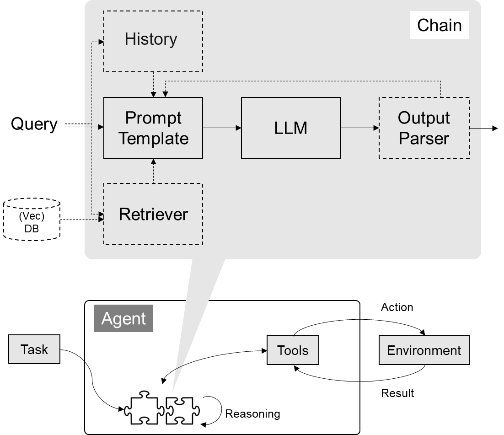

# 08 Langchain   Index


## 💡 这节课会带给你

1. 如何使用 LangChain：一套在大模型能力上封装的工具框架
2. 如何用几行代码实现一个复杂的 AI 应用
3. 面向大模型的流程开发的过程抽象

开始上课！

## 🎓 这节课怎么学

代码能力要求：**中高**，AI/数学基础要求：**无**

1. 有编程基础的同学
   - 关注设计思路，实现细节
2. 没有编程基础的同学
   - 尽量理解 SDK 的概念和价值，尝试体会使用 SDK 前后的差别与意义

## 写在前面

- LangChain 也是一套面向大模型的开发框架（SDK）
- LangChain 是 AGI 时代软件工程的一个探索和原型
- 学习 LangChain 要关注接口变更

## LangChain 的核心组件

1. 模型 I/O 封装
   - LLMs：大语言模型
   - Chat Models：一般基于 LLMs，但按对话结构重新封装
   - PromptTemple：提示词模板
   - OutputParser：解析输出
2. 数据连接封装
   - Document Loaders：各种格式文件的加载器
   - Document Transformers：对文档的常用操作，如：split, filter, translate, extract metadata, etc
   - Text Embedding Models：文本向量化表示，用于检索等操作（啥意思？别急，后面详细讲）
   - Verctorstores: （面向检索的）向量的存储
   - Retrievers: 向量的检索
3. 对话历史管理
   - 对话历史的存储、加载与剪裁
4. 架构封装
   - Chain：实现一个功能或者一系列顺序功能组合
   - Agent：根据用户输入，自动规划执行步骤，自动选择每步需要的工具，最终完成用户指定的功能
     - Tools：调用外部功能的函数，例如：调 google 搜索、文件 I/O、Linux Shell 等等
     - Toolkits：操作某软件的一组工具集，例如：操作 DB、操作 Gmail 等等
5. Callbacks



### 文档（以 Python 版为例）

- 功能模块：https://python.langchain.com/docs/get_started/introduction
- API 文档：https://api.python.langchain.com/en/latest/langchain_api_reference.html
- 三方组件集成：https://python.langchain.com/docs/integrations/platforms/
- 官方应用案例：https://python.langchain.com/docs/use_cases
- 调试部署等指导：https://python.langchain.com/docs/guides/debugging

## 一、模型 I/O 封装

把不同的模型，统一封装成一个接口，方便更换模型而不用重构代码。

### 1.1 模型 API：LLM vs. ChatModel

```python
# !pip install --upgrade langchain
# !pip install --upgrade langchain-openai
# !pip install --upgrade langchain-community
```

### 1.1.1 OpenAI 模型封装

```python
from langchain_openai import ChatOpenAI

llm = ChatOpenAI(model="gpt-4o-mini")  # 默认是gpt-3.5-turbo
response = llm.invoke("你是谁")
print(response.content)
```

**Output:**
```
我是一个人工智能助手，旨在回答问题和提供信息。有什么我可以帮助你的吗？
```

### 1.1.2 多轮对话 Session 封装

```python
from langchain.schema import (
    AIMessage,  # 等价于OpenAI接口中的assistant role
    HumanMessage,  # 等价于OpenAI接口中的user role
    SystemMessage  # 等价于OpenAI接口中的system role
)

messages = [
    SystemMessage(content="你是AGIClass的课程助理。"),
    HumanMessage(content="我是学员，我叫王卓然。"),
    AIMessage(content="欢迎！"),
    HumanMessage(content="我是谁")
]

ret = llm.invoke(messages)

print(ret.content)
```

**Output:**
```
你是王卓然，一位学员。如果你有任何问题或需要帮助的地方，请随时告诉我！
```

> ✅ **Tip:** 划重点：通过模型封装，实现不同模型的统一接口调用

### 1.1.3 换个国产模型

```python
# !pip install qianfan
```

```python
# 其它模型分装在 langchain_community 底包中
from langchain_community.chat_models import QianfanChatEndpoint
from langchain_core.messages import HumanMessage
import os

llm = QianfanChatEndpoint(
    qianfan_ak=os.getenv('ERNIE_CLIENT_ID'),
    qianfan_sk=os.getenv('ERNIE_CLIENT_SECRET')
)

messages = [
    HumanMessage(content="介绍一下你自己")
]

ret = llm.invoke(messages)

print(ret.content)
```

**Output:**
```
您好，我是文心一言，英文名是ERNIE Bot。我能够与人对话互动，回答问题，协助创作，高效便捷地帮助人们获取信息、知识和灵感。
```

### 1.2 模型的输入与输出


### 1.2.1 Prompt 模板封装

1. PromptTemplate 可以在模板中自定义变量

```python
from langchain.prompts import PromptTemplate

template = PromptTemplate.from_template("给我讲个关于{subject}的笑话")
print("===Template===")
print(template)
print("===Prompt===")
print(template.format(subject='小明'))
```

**Output:**
```
===Template===
input_variables=['subject'] input_types={} partial_variables={} template='给我讲个关于{subject}的笑话'
===Prompt===
给我讲个关于小明的笑话
```

```python
from langchain_openai import ChatOpenAI

# 定义 LLM
llm = ChatOpenAI()
# 通过 Prompt 调用 LLM
ret = llm.invoke(template.format(subject='小明'))
# 打印输出
print(ret.content)
```

**Output:**
```
好的，这是一个关于小明的笑话：

小明在学校上课的时候，老师问他：“小明，如果你有10块钱，买了一本书花了8块钱，那你还剩下几块钱？”小明想了想说：“老师，我会先去图书馆借书，然后我就能把那10块钱留着了！”老师无奈地笑了笑说：“小明，你真是个聪明的孩子！”
```

2. ChatPromptTemplate 用模板表示的对话上下文

```python
from langchain.prompts import (
    ChatPromptTemplate,
    HumanMessagePromptTemplate,
    SystemMessagePromptTemplate,
)
from langchain_openai import ChatOpenAI

template = ChatPromptTemplate.from_messages(
    [
        SystemMessagePromptTemplate.from_template(
            "你是{product}的客服助手。你的名字叫{name}"),
        HumanMessagePromptTemplate.from_template("{query}"),
    ]
)

llm = ChatOpenAI()
prompt = template.format_messages(
    product="AGI课堂",
    name="瓜瓜",
    query="你是谁"
)

print(prompt)

ret = llm.invoke(prompt)

print(ret.content)
```

**Output:**
```
[SystemMessage(content='你是AGI课堂的客服助手。你的名字叫瓜瓜', additional_kwargs={}, response_metadata={}), HumanMessage(content='你是谁', additional_kwargs={}, response_metadata={})]
你好，我是AGI课堂的客服助手，我的名字叫瓜瓜。有什么可以帮助你的吗？
```

3. MessagesPlaceholder 把多轮对话变成模板

```python
from langchain.prompts import (
    ChatPromptTemplate,
    HumanMessagePromptTemplate,
    MessagesPlaceholder,
)

human_prompt = "Translate your answer to {language}."
human_message_template = HumanMessagePromptTemplate.from_template(human_prompt)

chat_prompt = ChatPromptTemplate.from_messages(
    # variable_name 是 message placeholder 在模板中的变量名
    # 用于在赋值时使用
    [MessagesPlaceholder("history"), human_message_template]
)
```

```python
from langchain_core.messages import AIMessage, HumanMessage

human_message = HumanMessage(content="Who is Elon Musk?")
ai_message = AIMessage(
    content="Elon Musk is a billionaire entrepreneur, inventor, and industrial designer"
)

messages = chat_prompt.format_prompt(
    # 对 "history" 和 "language" 赋值
    history=[human_message, ai_message], language="中文"
)

print(messages.to_messages())
```

**Output:**
```
[HumanMessage(content='Who is Elon Musk?', additional_kwargs={}, response_metadata={}), AIMessage(content='Elon Musk is a billionaire entrepreneur, inventor, and industrial designer', additional_kwargs={}, response_metadata={}), HumanMessage(content='Translate your answer to 中文.', additional_kwargs={}, response_metadata={})]
```

```python
result = llm.invoke(messages)
print(result.content)
```

**Output:**
```
埃隆·马斯克是亿万富翁企业家、发明家和工业设计师。
```

> ✅ **Tip:** 划重点：把Prompt模板看作带有参数的函数

### 1.2.2、从文件加载 Prompt 模板

```python
from langchain.prompts import PromptTemplate

template = PromptTemplate.from_file("example_prompt_template.txt")
print("===Template===")
print(template)
print("===Prompt===")
print(template.format(topic='黑色幽默'))
```

**Output:**
```
===Template===
input_variables=['topic'] input_types={} partial_variables={} template='举一个关于{topic}的例子'
===Prompt===
举一个关于黑色幽默的例子
```

### 1.3 结构化输出

### 1.3.1 直接输出 Pydantic 对象

```python
from pydantic import BaseModel, Field

# 定义你的输出对象
class Date(BaseModel):
    year: int = Field(description="Year")
    month: int = Field(description="Month")
    day: int = Field(description="Day")
    era: str = Field(description="BC or AD")
```

```python
from langchain.prompts import PromptTemplate, ChatPromptTemplate, HumanMessagePromptTemplate
from langchain_openai import ChatOpenAI

from langchain_core.output_parsers import PydanticOutputParser


model_name = 'gpt-4o-mini'
temperature = 0
llm = ChatOpenAI(model_name=model_name, temperature=temperature)

# 定义结构化输出的模型
structured_llm = llm.with_structured_output(Date)

template = """提取用户输入中的日期。
用户输入:
{query}"""

prompt = PromptTemplate(
    template=template,
)

query = "2023年四月6日天气晴..."
input_prompt = prompt.format_prompt(query=query)

structured_llm.invoke(input_prompt)
```

**Output:**
```
Date(year=2023, month=4, day=6, era='AD')
```

### 1.3.2 输出指定格式的 JSON

```python
json_schema = {
    "title": "Date",
    "description": "Formated date expression",
    "type": "object",
    "properties": {
        "year": {
            "type": "integer",
            "description": "year, YYYY",
        },
        "month": {
            "type": "integer",
            "description": "month, MM",
        },
        "day": {
            "type": "integer",
            "description": "day, DD",
        },
        "era": {
            "type": "string",
            "description": "BC or AD",
        },
    },
}
structured_llm = llm.with_structured_output(json_schema)

structured_llm.invoke(input_prompt)
```

**Output:**
```
{'year': 2023, 'month': 4, 'day': 6}
```

### 1.3.3 使用 OutputParser

[`OutputParser`](https://python.langchain.com/v0.2/docs/concepts/#output-parsers) 可以按指定格式解析模型的输出

```python
from langchain_core.output_parsers import JsonOutputParser

parser = JsonOutputParser(pydantic_object=Date)

prompt = PromptTemplate(
    template="提取用户输入中的日期。\n用户输入:{query}\n{format_instructions}",
    input_variables=["query"],
    partial_variables={"format_instructions": parser.get_format_instructions()},
)

input_prompt = prompt.format_prompt(query=query)
output = llm.invoke(input_prompt)
print("原始输出:\n"+output.content)

print("\n解析后:")
parser.invoke(output)
```

**Output:**
```
原始输出:
```json
{"year": 2023, "month": 4, "day": 6, "era": "AD"}
```

解析后:
{'year': 2023, 'month': 4, 'day': 6, 'era': 'AD'}
```

也可以用 `PydanticOutputParser`

```python
from langchain_core.output_parsers import PydanticOutputParser

parser = PydanticOutputParser(pydantic_object=Date)

input_prompt = prompt.format_prompt(query=query)
output = llm.invoke(input_prompt)
print("原始输出:\n"+output.content)

print("\n解析后:")
parser.invoke(output)
```

**Output:**
```
原始输出:
```json
{"year": 2023, "month": 4, "day": 6, "era": "AD"}
```

解析后:
Date(year=2023, month=4, day=6, era='AD')
```

`OutputFixingParser` 利用大模型做格式自动纠错

```python
from langchain.output_parsers import OutputFixingParser

new_parser = OutputFixingParser.from_llm(parser=parser, llm=ChatOpenAI())

bad_output = output.content.replace("4","四")
print("PydanticOutputParser:")
try:
    parser.invoke(bad_output)
except Exception as e:
    print(e)

print("OutputFixingParser:")
new_parser.invoke(bad_output)
```

**Output:**
```
PydanticOutputParser:
Invalid json output: ```json
{"year": 2023, "month": 四, "day": 6, "era": "AD"}
```
OutputFixingParser:
Date(year=2023, month=4, day=6, era='AD')
```

### 1.4 Function Calling

```python
from langchain_core.tools import tool

@tool
def add(a: int, b: int) -> int:
    """Add two integers.

    Args:
        a: First integer
        b: Second integer
    """
    return a + b

@tool
def multiply(a: int, b: int) -> int:
    """Multiply two integers.

    Args:
        a: First integer
        b: Second integer
    """
    return a * b
```

```python
import json

llm_with_tools = llm.bind_tools([add, multiply])

query = "3的4倍是多少?"
messages = [HumanMessage(query)]

output = llm_with_tools.invoke(messages)

print(json.dumps(output.tool_calls, indent=4))
```

**Output:**
```
[
    {
        "name": "multiply",
        "args": {
            "a": 3,
            "b": 4
        },
        "id": "call_GMsOIw8IPJMy3SrnlbroVcd3",
        "type": "tool_call"
    }
]
```

回传 Funtion Call 的结果

```python
messages.append(output)

available_tools = {"add": add, "multiply": multiply}

for tool_call in output.tool_calls:
    selected_tool = available_tools[tool_call["name"].lower()]
    tool_msg = selected_tool.invoke(tool_call)
    messages.append(tool_msg)

new_output = llm_with_tools.invoke(messages)
for message in messages:
    print(json.dumps(message.dict(), indent=4, ensure_ascii=False))
print(new_output.content)
```

**Output:**
```
{
    "content": "3的4倍是多少?",
    "additional_kwargs": {},
    "response_metadata": {},
    "type": "human",
    "name": null,
    "id": null,
    "example": false
}
{
    "content": "",
    "additional_kwargs": {
        "tool_calls": [
            {
                "id": "call_GMsOIw8IPJMy3SrnlbroVcd3",
                "function": {
                    "arguments": "{\"a\":3,\"b\":4}",
                    "name": "multiply"
                },
                "type": "function"
            }
        ],
        "refusal": null
    },
    "response_metadata": {
        "token_usage": {
            "completion_tokens": 17,
            "prompt_tokens": 97,
            "total_tokens": 114,
            "prompt_tokens_details": {
                "cached_tokens": 0
            },
            "completion_tokens_details": {
                "reasoning_tokens": 0
            }
        },
        "model_name": "gpt-4o-mini-2024-07-18",
        "system_fingerprint": "fp_e2bde53e6e",
        "finish_reason": "tool_calls",
        "logprobs": null
    },
    "type": "ai",
    "name": null,
    "id": "run-c4dffb82-95e3-45af-a371-6391092a08a8-0",
    "example": false,
    "tool_calls": [
        {
            "name": "multiply",
            "args": {
                "a": 3,
                "b": 4
            },
            "id": "call_GMsOIw8IPJMy3SrnlbroVcd3",
            "type": "tool_call"
        }
    ],
    "invalid_tool_calls": [],
    "usage_metadata": {
        "input_tokens": 97,
        "output_tokens": 17,
        "total_tokens": 114,
        "input_token_details": {
            "cache_read": 0
        },
        "output_token_details": {
            "reasoning": 0
        }
    }
}
{
    "content": "12",
    "additional_kwargs": {},
    "response_metadata": {},
    "type": "tool",
    "name": "multiply",
    "id": null,
    "tool_call_id": "call_GMsOIw8IPJMy3SrnlbroVcd3",
    "artifact": null,
    "status": "success"
}
3的4倍是12。
```

### 1.5、小结

1. LangChain 统一封装了各种模型的调用接口，包括补全型和对话型两种
2. LangChain 提供了 PromptTemplate 类，可以自定义带变量的模板
3. LangChain 提供了一些列输出解析器，用于将大模型的输出解析成结构化对象
4. LangChain 提供了 Function Calling 的封装
5. 上述模型属于 LangChain 中较为实用的部分

## 二、数据连接封装


### 2.1 文档加载器：Document Loaders

```bash
#!pip install pymupdf
```

```python
from langchain_community.document_loaders import PyMuPDFLoader

loader = PyMuPDFLoader("llama2.pdf")
pages = loader.load_and_split()

print(pages[0].page_content)
```

**Output:**
```
Llama 2: Open Foundation and Fine-Tuned Chat Models
Hugo Touvron∗
Louis Martin†
Kevin Stone†
Peter Albert Amjad Almahairi Yasmine Babaei Nikolay Bashlykov Soumya Batra
Prajjwal Bhargava Shruti Bhosale Dan Bikel Lukas Blecher Cristian Canton Ferrer Moya Chen
Guillem Cucurull David Esiobu Jude Fernandes Jeremy Fu Wenyin Fu Brian Fuller
Cynthia Gao Vedanuj Goswami Naman Goyal Anthony Hartshorn Saghar Hosseini Rui Hou
Hakan Inan Marcin Kardas Viktor Kerkez Madian Khabsa Isabel Kloumann Artem Korenev
Punit Singh Koura Marie-Anne Lachaux Thibaut Lavril Jenya Lee Diana Liskovich
Yinghai Lu Yuning Mao Xavier Martinet Todor Mihaylov Pushkar Mishra
Igor Molybog Yixin Nie Andrew Poulton Jeremy Reizenstein Rashi Rungta Kalyan Saladi
Alan Schelten Ruan Silva Eric Michael Smith Ranjan Subramanian Xiaoqing Ellen Tan Binh Tang
Ross Taylor Adina Williams Jian Xiang Kuan Puxin Xu Zheng Yan Iliyan Zarov Yuchen Zhang
Angela Fan Melanie Kambadur Sharan Narang Aurelien Rodriguez Robert Stojnic
Sergey Edunov
Thomas Scialom∗
GenAI, Meta
Abstract
In this work, we develop and release Llama 2, a collection of pretrained and fine-tuned
large language models (LLMs) ranging in scale from 7 billion to 70 billion parameters.
Our fine-tuned LLMs, called Llama 2-Chat, are optimized for dialogue use cases. Our
models outperform open-source chat models on most benchmarks we tested, and based on
our human evaluations for helpfulness and safety, may be a suitable substitute for closed-
source models. We provide a detailed description of our approach to fine-tuning and safety
improvements of Llama 2-Chat in order to enable the community to build on our work and
contribute to the responsible development of LLMs.
∗Equal contribution, corresponding authors: {tscialom, htouvron}@meta.com
†Second author
Contributions for all the authors can be found in Section A.1.
arXiv:2307.09288v2  [cs.CL]  19 Jul 2023
```

### 2.2 文档处理器

### 2.2.1 TextSplitter

```bash
#!pip install --upgrade langchain-text-splitters
```

```python
from langchain_text_splitters import RecursiveCharacterTextSplitter

text_splitter = RecursiveCharacterTextSplitter(
    chunk_size=200,
    chunk_overlap=100, 
    length_function=len,
    add_start_index=True,
)

paragraphs = text_splitter.create_documents([pages[0].page_content])
for para in paragraphs:
    print(para.page_content)
    print('-------')
```

**Output:**
```
Llama 2: Open Foundation and Fine-Tuned Chat Models
Hugo Touvron∗
Louis Martin†
Kevin Stone†
Peter Albert Amjad Almahairi Yasmine Babaei Nikolay Bashlykov Soumya Batra
-------
Kevin Stone†
Peter Albert Amjad Almahairi Yasmine Babaei Nikolay Bashlykov Soumya Batra
Prajjwal Bhargava Shruti Bhosale Dan Bikel Lukas Blecher Cristian Canton Ferrer Moya Chen
-------
Prajjwal Bhargava Shruti Bhosale Dan Bikel Lukas Blecher Cristian Canton Ferrer Moya Chen
Guillem Cucurull David Esiobu Jude Fernandes Jeremy Fu Wenyin Fu Brian Fuller
-------
Guillem Cucurull David Esiobu Jude Fernandes Jeremy Fu Wenyin Fu Brian Fuller
Cynthia Gao Vedanuj Goswami Naman Goyal Anthony Hartshorn Saghar Hosseini Rui Hou
-------
Cynthia Gao Vedanuj Goswami Naman Goyal Anthony Hartshorn Saghar Hosseini Rui Hou
Hakan Inan Marcin Kardas Viktor Kerkez Madian Khabsa Isabel Kloumann Artem Korenev
-------
Hakan Inan Marcin Kardas Viktor Kerkez Madian Khabsa Isabel Kloumann Artem Korenev
Punit Singh Koura Marie-Anne Lachaux Thibaut Lavril Jenya Lee Diana Liskovich
-------
Punit Singh Koura Marie-Anne Lachaux Thibaut Lavril Jenya Lee Diana Liskovich
Yinghai Lu Yuning Mao Xavier Martinet Todor Mihaylov Pushkar Mishra
-------
Yinghai Lu Yuning Mao Xavier Martinet Todor Mihaylov Pushkar Mishra
Igor Molybog Yixin Nie Andrew Poulton Jeremy Reizenstein Rashi Rungta Kalyan Saladi
-------
Igor Molybog Yixin Nie Andrew Poulton Jeremy Reizenstein Rashi Rungta Kalyan Saladi
Alan Schelten Ruan Silva Eric Michael Smith Ranjan Subramanian Xiaoqing Ellen Tan Binh Tang
-------
Alan Schelten Ruan Silva Eric Michael Smith Ranjan Subramanian Xiaoqing Ellen Tan Binh Tang
Ross Taylor Adina Williams Jian Xiang Kuan Puxin Xu Zheng Yan Iliyan Zarov Yuchen Zhang
-------
Ross Taylor Adina Williams Jian Xiang Kuan Puxin Xu Zheng Yan Iliyan Zarov Yuchen Zhang
Angela Fan Melanie Kambadur Sharan Narang Aurelien Rodriguez Robert Stojnic
Sergey Edunov
Thomas Scialom∗
-------
Sergey Edunov
Thomas Scialom∗
GenAI, Meta
Abstract
In this work, we develop and release Llama 2, a collection of pretrained and fine-tuned
-------
Abstract
In this work, we develop and release Llama 2, a collection of pretrained and fine-tuned
large language models (LLMs) ranging in scale from 7 billion to 70 billion parameters.
-------
large language models (LLMs) ranging in scale from 7 billion to 70 billion parameters.
Our fine-tuned LLMs, called Llama 2-Chat, are optimized for dialogue use cases. Our
-------
Our fine-tuned LLMs, called Llama 2-Chat, are optimized for dialogue use cases. Our
models outperform open-source chat models on most benchmarks we tested, and based on
-------
models outperform open-source chat models on most benchmarks we tested, and based on
our human evaluations for helpfulness and safety, may be a suitable substitute for closed-
-------
our human evaluations for helpfulness and safety, may be a suitable substitute for closed-
source models. We provide a detailed description of our approach to fine-tuning and safety
-------
source models. We provide a detailed description of our approach to fine-tuning and safety
improvements of Llama 2-Chat in order to enable the community to build on our work and
-------
improvements of Llama 2-Chat in order to enable the community to build on our work and
contribute to the responsible development of LLMs.
-------
contribute to the responsible development of LLMs.
∗Equal contribution, corresponding authors: {tscialom, htouvron}@meta.com
†Second author
-------
∗Equal contribution, corresponding authors: {tscialom, htouvron}@meta.com
†Second author
Contributions for all the authors can be found in Section A.1.
arXiv:2307.09288v2  [cs.CL]  19 Jul 2023
-------
```

> ℹ️ **Info:** 类似 LlamaIndex，LangChain 也提供了丰富的 Document Loaders 和 Text Splitters。

### 2.3、向量数据库与向量检索

```python
from langchain_openai import OpenAIEmbeddings
from langchain_text_splitters import RecursiveCharacterTextSplitter
from langchain_community.vectorstores import FAISS
from langchain_openai import ChatOpenAI
from langchain_community.document_loaders import PyMuPDFLoader

# 加载文档
loader = PyMuPDFLoader("llama2.pdf")
pages = loader.load_and_split()

# 文档切分
text_splitter = RecursiveCharacterTextSplitter(
    chunk_size=300,
    chunk_overlap=100,
    length_function=len,
    add_start_index=True,
)

texts = text_splitter.create_documents(
    [page.page_content for page in pages[:4]]
)

# 灌库
embeddings = OpenAIEmbeddings(model="text-embedding-ada-002")
db = FAISS.from_documents(texts, embeddings)

# 检索 top-3 结果
retriever = db.as_retriever(search_kwargs={"k": 3})

docs = retriever.invoke("llama2有多少参数")

for doc in docs:
    print(doc.page_content)
    print("----")
```

**Output:**
```
but are not releasing.§
2. Llama 2-Chat, a fine-tuned version of Llama 2 that is optimized for dialogue use cases. We release
variants of this model with 7B, 13B, and 70B parameters as well.
We believe that the open release of LLMs, when done safely, will be a net benefit to society. Like all LLMs,
----
Llama 2-Chat, at scales up to 70B parameters. On the series of helpfulness and safety benchmarks we tested,
Llama 2-Chat models generally perform better than existing open-source models. They also appear to
----
large language models (LLMs) ranging in scale from 7 billion to 70 billion parameters.
Our fine-tuned LLMs, called Llama 2-Chat, are optimized for dialogue use cases. Our
models outperform open-source chat models on most benchmarks we tested, and based on
----
```

更多的三方检索组件链接，参考：https://python.langchain.com/v0.2/docs/integrations/vectorstores/

### 2.4、小结

1. 文档处理部分，建议在实际应用中详细测试后使用
2. 与向量数据库的链接部分本质是接口封装，向量数据库需要自己选型

## 三、对话历史管理

### 3.1、历史记录的剪裁

```python
from langchain_core.messages import (
    AIMessage,
    HumanMessage,
    SystemMessage,
    trim_messages,
)
from langchain_openai import ChatOpenAI

messages = [
    SystemMessage("you're a good assistant, you always respond with a joke."),
    HumanMessage("i wonder why it's called langchain"),
    AIMessage(
        'Well, I guess they thought "WordRope" and "SentenceString" just didn\'t have the same ring to it!'
    ),
    HumanMessage("and who is harrison chasing anyways"),
    AIMessage(
        "Hmmm let me think.\n\nWhy, he's probably chasing after the last cup of coffee in the office!"
    ),
    HumanMessage("what do you call a speechless parrot"),
]

trim_messages(
    messages,
    max_tokens=45,
    strategy="last",
    token_counter=ChatOpenAI(model="gpt-4o-mini"),
)
```

**Output:**
```
[AIMessage(content="Hmmm let me think.\n\nWhy, he's probably chasing after the last cup of coffee in the office!", additional_kwargs={}, response_metadata={}),
 HumanMessage(content='what do you call a speechless parrot', additional_kwargs={}, response_metadata={})]
```

```python
# 保留 system prompt
trim_messages(
    messages,
    max_tokens=45,
    strategy="last",
    token_counter=ChatOpenAI(model="gpt-4o-mini"),
    include_system=True,
    allow_partial=True,
)
```

**Output:**
```
[SystemMessage(content="you're a good assistant, you always respond with a joke.", additional_kwargs={}, response_metadata={}),
 HumanMessage(content='what do you call a speechless parrot', additional_kwargs={}, response_metadata={})]
```

### 3.2、过滤带标识的历史记录

```python
from langchain_core.messages import (
    AIMessage,
    HumanMessage,
    SystemMessage,
    filter_messages,
)

messages = [
    SystemMessage("you are a good assistant", id="1"),
    HumanMessage("example input", id="2", name="example_user"),
    AIMessage("example output", id="3", name="example_assistant"),
    HumanMessage("real input", id="4", name="bob"),
    AIMessage("real output", id="5", name="alice"),
]

filter_messages(messages, include_types="human")
```

**Output:**
```
[HumanMessage(content='example input', additional_kwargs={}, response_metadata={}, name='example_user', id='2'),
 HumanMessage(content='real input', additional_kwargs={}, response_metadata={}, name='bob', id='4')]
```

```python
filter_messages(messages, exclude_names=["example_user", "example_assistant"])
```

**Output:**
```
[SystemMessage(content='you are a good assistant', additional_kwargs={}, response_metadata={}, id='1'),
 HumanMessage(content='real input', additional_kwargs={}, response_metadata={}, name='bob', id='4'),
 AIMessage(content='real output', additional_kwargs={}, response_metadata={}, name='alice', id='5')]
```

```python
filter_messages(messages, include_types=[HumanMessage, AIMessage], exclude_ids=["3"])
```

**Output:**
```
[HumanMessage(content='example input', additional_kwargs={}, response_metadata={}, name='example_user', id='2'),
 HumanMessage(content='real input', additional_kwargs={}, response_metadata={}, name='bob', id='4'),
 AIMessage(content='real output', additional_kwargs={}, response_metadata={}, name='alice', id='5')]
```

> ℹ️ **Info:** 思考：你能想出这个功能的一个使用场景吗？

## 四、Chain 和 LangChain Expression Language (LCEL)

LangChain Expression Language（LCEL）是一种声明式语言，可轻松组合不同的调用顺序构成 Chain。LCEL 自创立之初就被设计为能够支持将原型投入生产环境，**无需代码更改**，从最简单的“提示+LLM”链到最复杂的链（已有用户成功在生产环境中运行包含数百个步骤的 LCEL Chain）。

LCEL 的一些亮点包括：

1. **流支持**：使用 LCEL 构建 Chain 时，你可以获得最佳的首个令牌时间（即从输出开始到首批输出生成的时间）。对于某些 Chain，这意味着可以直接从 LLM 流式传输令牌到流输出解析器，从而以与 LLM 提供商输出原始令牌相同的速率获得解析后的、增量的输出。

2. **异步支持**：任何使用 LCEL 构建的链条都可以通过同步 API（例如，在 Jupyter 笔记本中进行原型设计时）和异步 API（例如，在 LangServe 服务器中）调用。这使得相同的代码可用于原型设计和生产环境，具有出色的性能，并能够在同一服务器中处理多个并发请求。

3. **优化的并行执行**：当你的 LCEL 链条有可以并行执行的步骤时（例如，从多个检索器中获取文档），我们会自动执行，无论是在同步还是异步接口中，以实现最小的延迟。

4. **重试和回退**：为 LCEL 链的任何部分配置重试和回退。这是使链在规模上更可靠的绝佳方式。目前我们正在添加重试/回退的流媒体支持，因此你可以在不增加任何延迟成本的情况下获得增加的可靠性。

5. **访问中间结果**：对于更复杂的链条，访问在最终输出产生之前的中间步骤的结果通常非常有用。这可以用于让最终用户知道正在发生一些事情，甚至仅用于调试链条。你可以流式传输中间结果，并且在每个 LangServe 服务器上都可用。

6. **输入和输出模式**：输入和输出模式为每个 LCEL 链提供了从链的结构推断出的 Pydantic 和 JSONSchema 模式。这可以用于输入和输出的验证，是 LangServe 的一个组成部分。

7. **无缝 LangSmith 跟踪集成**：随着链条变得越来越复杂，理解每一步发生了什么变得越来越重要。通过 LCEL，所有步骤都自动记录到 LangSmith，以实现最大的可观察性和可调试性。

8. **无缝 LangServe 部署集成**：任何使用 LCEL 创建的链都可以轻松地使用 LangServe 进行部署。

原文：https://python.langchain.com/docs/expression_language/

### 4.1 Pipeline 式调用 PromptTemplate, LLM 和 OutputParser

```python
from langchain_openai import ChatOpenAI
from langchain.prompts import ChatPromptTemplate
from langchain_core.output_parsers import StrOutputParser
from langchain_core.runnables import RunnablePassthrough
from pydantic import BaseModel, Field, validator
from typing import List, Dict, Optional
from enum import Enum
import json
```

```python
# 输出结构
class SortEnum(str, Enum):
    data = 'data'
    price = 'price'


class OrderingEnum(str, Enum):
    ascend = 'ascend'
    descend = 'descend'


class Semantics(BaseModel):
    name: Optional[str] = Field(description="流量包名称", default=None)
    price_lower: Optional[int] = Field(description="价格下限", default=None)
    price_upper: Optional[int] = Field(description="价格上限", default=None)
    data_lower: Optional[int] = Field(description="流量下限", default=None)
    data_upper: Optional[int] = Field(description="流量上限", default=None)
    sort_by: Optional[SortEnum] = Field(description="按价格或流量排序", default=None)
    ordering: Optional[OrderingEnum] = Field(
        description="升序或降序排列", default=None)


# Prompt 模板
prompt = ChatPromptTemplate.from_messages(
    [
        ("system", "你是一个语义解析器。你的任务是将用户的输入解析成JSON表示。不要回答用户的问题。"),
        ("human", "{text}"),
    ]
)

# 模型
llm = ChatOpenAI(model="gpt-4o", temperature=0)

structured_llm = llm.with_structured_output(Semantics)

# LCEL 表达式
runnable = (
    {"text": RunnablePassthrough()} | prompt | structured_llm
)

# 直接运行
ret = runnable.invoke("不超过100元的流量大的套餐有哪些")
print(
    json.dumps(
        ret.dict(),
        indent = 4,
        ensure_ascii=False
    )
)
```

**Output:**
```
{
    "name": null,
    "price_lower": null,
    "price_upper": 100,
    "data_lower": null,
    "data_upper": null,
    "sort_by": "data",
    "ordering": "descend"
}
```

#### 流式输出

```python
prompt = PromptTemplate.from_template("讲个关于{topic}的笑话")

runnable = (
    {"topic": RunnablePassthrough()} | prompt | llm | StrOutputParser()
)


# 流式输出
for s in runnable.stream("小明"):
    print(s, end="", flush=True)
```

**Output:**
```
小明在课堂上，老师问：“如果地球是一个苹果，你们觉得我们生活在苹果的哪个部分？”

小明举手回答：“老师，我觉得我们生活在苹果的WiFi信号最差的地方！”

老师愣了一下，问：“为什么这么说？”

小明说：“因为我在家里总是找不到信号！”
```

> ⚠️ **Note:** 注意: 在当前的文档中 LCEL 产生的对象，被叫做 runnable 或 chain，经常两种叫法混用。本质就是一个自定义调用流程。

> ✅ **Tip:** 使用 LCEL 的价值，也就是 LangChain 的核心价值。 
官方从不同角度给出了举例说明：https://python.langchain.com/v0.1/docs/expression_language/why/

### 4.2 用 LCEL 实现 RAG

```python
from langchain_openai import OpenAIEmbeddings
from langchain_text_splitters import RecursiveCharacterTextSplitter
from langchain_community.vectorstores import FAISS
from langchain_openai import ChatOpenAI
from langchain.chains import RetrievalQA
from langchain_community.document_loaders import PyMuPDFLoader

# 加载文档
loader = PyMuPDFLoader("llama2.pdf")
pages = loader.load_and_split()

# 文档切分
text_splitter = RecursiveCharacterTextSplitter(
    chunk_size=300,
    chunk_overlap=100,
    length_function=len,
    add_start_index=True,
)

texts = text_splitter.create_documents(
    [page.page_content for page in pages[:4]]
)

# 灌库
embeddings = OpenAIEmbeddings(model="text-embedding-ada-002")
db = FAISS.from_documents(texts, embeddings)

# 检索 top-2 结果
retriever = db.as_retriever(search_kwargs={"k": 2})
```

```python
from langchain.schema.output_parser import StrOutputParser
from langchain.schema.runnable import RunnablePassthrough

# Prompt模板
template = """Answer the question based only on the following context:
{context}

Question: {question}
"""
prompt = ChatPromptTemplate.from_template(template)

# Chain
rag_chain = (
    {"question": RunnablePassthrough(), "context": retriever}
    | prompt
    | llm
    | StrOutputParser()
)

rag_chain.invoke("Llama 2有多少参数")
```

**Output:**
```
'Llama 2有7B、13B和70B参数的变体。'
```

### 4.3 用 LCEL 实现工厂模式（选）

```python
from langchain_core.runnables.utils import ConfigurableField
from langchain_openai import ChatOpenAI
from langchain_community.chat_models import QianfanChatEndpoint
from langchain.prompts import (
    ChatPromptTemplate,
    HumanMessagePromptTemplate,
)
from langchain.schema import HumanMessage
import os

# 模型1
ernie_model = QianfanChatEndpoint(
    qianfan_ak=os.getenv('ERNIE_CLIENT_ID'),
    qianfan_sk=os.getenv('ERNIE_CLIENT_SECRET')
)

# 模型2
gpt_model = ChatOpenAI(model="gpt-4o-mini", temperature=0)


# 通过 configurable_alternatives 按指定字段选择模型
model = gpt_model.configurable_alternatives(
    ConfigurableField(id="llm"), 
    default_key="gpt", 
    ernie=ernie_model,
    # claude=claude_model,
)

# Prompt 模板
prompt = ChatPromptTemplate.from_messages(
    [
        HumanMessagePromptTemplate.from_template("{query}"),
    ]
)

# LCEL
chain = (
    {"query": RunnablePassthrough()} 
    | prompt
    | model 
    | StrOutputParser()
)

# 运行时指定模型 "gpt" or "ernie"
ret = chain.with_config(configurable={"llm": "gpt"}).invoke("请自我介绍")

print(ret)
```

**Output:**
```
你好！我是一个人工智能助手，旨在帮助你解答问题、提供信息和支持各种任务。我可以处理多种主题，包括科技、历史、文化、语言学习等。如果你有任何问题或需要帮助的地方，请随时告诉我！
```

扩展阅读：什么是[**工厂模式**](https://www.runoob.com/design-pattern/factory-pattern.html)；[**设计模式**](https://www.runoob.com/design-pattern/design-pattern-intro.html)概览。

> ⚠️ **Note:** 思考：从模块间解依赖角度，LCEL的意义是什么？

### 4.4 存储与管理对话历史

```python
from langchain_community.chat_message_histories import SQLChatMessageHistory

def get_session_history(session_id):
    # 通过 session_id 区分对话历史，并存储在 sqlite 数据库中
    return SQLChatMessageHistory(session_id, "sqlite:///memory.db")
```

```python
from langchain_core.messages import HumanMessage
from langchain_core.runnables.history import RunnableWithMessageHistory
from langchain_openai import ChatOpenAI
from langchain.schema.output_parser import StrOutputParser

model = ChatOpenAI(model="gpt-4o-mini", temperature=0)

runnable = model | StrOutputParser()

runnable_with_history = RunnableWithMessageHistory(
    runnable, # 指定 runnable
    get_session_history, # 指定自定义的历史管理方法
)

runnable_with_history.invoke(
    [HumanMessage(content="你好，我叫王卓然")],
    config={"configurable": {"session_id": "wzr"}},
)
```

**Output:**
```
'你好，王卓然！很高兴再次见到你。有什么想聊的或者需要帮助的呢？'
```

```python
runnable_with_history.invoke(
    [HumanMessage(content="你知道我叫什么名字")],
    config={"configurable": {"session_id": "wzr"}},
)
```

**Output:**
```
'是的，你叫王卓然。有什么我可以帮助你的吗？'
```

```python
runnable_with_history.invoke(
    [HumanMessage(content="你知道我叫什么名字")],
    config={"configurable": {"session_id": "test"}},
)
```

**Output:**
```
'抱歉，我无法知道你的名字。你可以告诉我你的名字，或者如果你有其他问题，我也很乐意帮助你！'
```

### 通过 LCEL，还可以实现

1. 配置运行时变量：https://python.langchain.com/v0.2/docs/how_to/configure/
2. 故障回退：https://python.langchain.com/v0.2/docs/how_to/fallbacks
3. 并行调用：https://python.langchain.com/v0.2/docs/how_to/parallel/
4. 逻辑分支：https://python.langchain.com/v0.2/docs/how_to/routing/
5. 动态创建 Chain: https://python.langchain.com/v0.2/docs/how_to/dynamic_chain/

更多例子：https://python.langchain.com/v0.2/docs/how_to/lcel_cheatsheet/

## 五、智能体架构：Agent

### 5.1 什么是智能体（Agent）

将大语言模型作为一个推理引擎。给定一个任务，智能体自动生成完成任务所需的步骤，执行相应动作（例如选择并调用工具），直到任务完成。


### 5.2 先定义一些工具：Tools

- 可以是一个函数或三方 API
- 也可以把一个 Chain 或者 Agent 的 run()作为一个 Tool

```python
from langchain_community.utilities import SerpAPIWrapper
from langchain.tools import Tool, tool

search = SerpAPIWrapper()
tools = [
    Tool.from_function(
        func=search.run,
        name="Search",
        description="useful for when you need to answer questions about current events"
    ),
]
```

需要注册 [SerpAPI](https://serpapi.com/)（限量免费），并将 `SERPAPI_API_KEY` 写在环境变量中

```python
import calendar
import dateutil.parser as parser
from datetime import date

# 自定义工具


@tool("weekday")
def weekday(date_str: str) -> str:
    """Convert date to weekday name"""
    d = parser.parse(date_str)
    return calendar.day_name[d.weekday()]


tools += [weekday]
```

### 5.3 智能体类型：ReAct


```python
# !pip install google-search-results
```

```python
# !pip install --upgrade langchainhub
```

```python
from langchain import hub
import json

# 下载一个现有的 Prompt 模板
react_prompt = hub.pull("hwchase17/react")

print(react_prompt.template)
```

**Output:**
```
Answer the following questions as best you can. You have access to the following tools:

{tools}

Use the following format:

Question: the input question you must answer
Thought: you should always think about what to do
Action: the action to take, should be one of [{tool_names}]
Action Input: the input to the action
Observation: the result of the action
... (this Thought/Action/Action Input/Observation can repeat N times)
Thought: I now know the final answer
Final Answer: the final answer to the original input question

Begin!

Question: {input}
Thought:{agent_scratchpad}
```

```python
from langchain_openai import ChatOpenAI
from langchain.agents import AgentExecutor, create_react_agent


llm = ChatOpenAI(model_name='gpt-4o', temperature=0, seed=23)

# 定义一个 agent: 需要大模型、工具集、和 Prompt 模板
agent = create_react_agent(llm, tools, react_prompt)
# 定义一个执行器：需要 agent 对象 和 工具集
agent_executor = AgentExecutor(agent=agent, tools=tools, verbose=True)

# 执行
agent_executor.invoke({"input": "2024年周杰伦的演唱会星期几"})
```

**Output:**
```
> Entering new AgentExecutor chain...
To determine the weekday of Jay Chou's concert in 2024, I need to know the specific date of the concert. Once I have the date, I can find out the weekday. 

Action: Search
Action Input: "2024 Jay Chou concert dates"['Trending Performers · 8 events in all locations · Oct 11. Fri. 8:00 PM. This week. Singapore National Stadium. Singapore, Singapore · Oct 12. Sat. 7:30 PM.', 'Jay Chou Tour Dates See the Jay Chou concert schedule for 2024. · All Tour Dates · Oct. 11. 2024. Fri. Singapore National Stadium. Singapore, Singapore · Oct.', 'Unfortunately there are no concert dates for Jay Chou scheduled in 2024. Songkick is the first to know of new tour announcements and concert information, so if ...', 'Tour dates. edit. List of concert dates. Date, City, Country, Venue, Attendance ... ^ "Jay Chou Carnival World Tour 2024 - Singapore". Singapore Sports Hub ...', 'Jay Chou Singapore Concert 2024 Details · Jay Chou Carnival World Tour 2024 – Singapore · Date and time: 11 October 2024 (Friday) 20:00, 12-13 October 2024 ( ...', "Jay Chou is playing in Shenzhencun on Sep 12, 2024, 7:00 PM at 深圳大运中心体育场. Buy tickets, find concert information, and get ready for Jay Chou's show!", 'Concert tours ; 2019–2024, Carnival World Tour, October 17, 2019 – present ; The Carnival World Tour commenced in October 2019, and was halted by the COVID-19 ...', 'Tickets for Jay Chou Carnival World Tour Australia 2024 – Melbourne tickets will go on sale at 12pm on 26 October 2023, and Sydney tickets will go on sale at 2 ...', 'Jay Chou tickets for the upcoming concert tour are on sale at StubHub. Buy and sell your Jay Chou concert tickets today. Tickets are 100% guaranteed by ...', "'King of Mandopop' Jay Chou first to give solo concert at Taipei Dome | Taiwan News | Sep. 7, 2024 19:40."]I found that Jay Chou has a concert scheduled for October 11, 2024, which is a Friday. 

Final Answer: Jay Chou's concert on October 11, 2024, is on a Friday.

> Finished chain.
{'input': '2024年周杰伦的演唱会星期几',
 'output': "Jay Chou's concert on October 11, 2024, is on a Friday."}
```

### 5.4 智能体类型：SelfAskWithSearch

```python
# 下载一个模板
self_ask_prompt = hub.pull("hwchase17/self-ask-with-search")

print(self_ask_prompt.template)
```

**Output:**
```
Question: Who lived longer, Muhammad Ali or Alan Turing?
Are follow up questions needed here: Yes.
Follow up: How old was Muhammad Ali when he died?
Intermediate answer: Muhammad Ali was 74 years old when he died.
Follow up: How old was Alan Turing when he died?
Intermediate answer: Alan Turing was 41 years old when he died.
So the final answer is: Muhammad Ali

Question: When was the founder of craigslist born?
Are follow up questions needed here: Yes.
Follow up: Who was the founder of craigslist?
Intermediate answer: Craigslist was founded by Craig Newmark.
Follow up: When was Craig Newmark born?
Intermediate answer: Craig Newmark was born on December 6, 1952.
So the final answer is: December 6, 1952

Question: Who was the maternal grandfather of George Washington?
Are follow up questions needed here: Yes.
Follow up: Who was the mother of George Washington?
Intermediate answer: The mother of George Washington was Mary Ball Washington.
Follow up: Who was the father of Mary Ball Washington?
Intermediate answer: The father of Mary Ball Washington was Joseph Ball.
So the final answer is: Joseph Ball

Question: Are both the directors of Jaws and Casino Royale from the same country?
Are follow up questions needed here: Yes.
Follow up: Who is the director of Jaws?
Intermediate answer: The director of Jaws is Steven Spielberg.
Follow up: Where is Steven Spielberg from?
Intermediate answer: The United States.
Follow up: Who is the director of Casino Royale?
Intermediate answer: The director of Casino Royale is Martin Campbell.
Follow up: Where is Martin Campbell from?
Intermediate answer: New Zealand.
So the final answer is: No

Question: {input}
Are followup questions needed here:{agent_scratchpad}
```

```python
from langchain.agents import create_self_ask_with_search_agent

tools = [
    Tool(
        name="Intermediate Answer",
        func=search.run,
        description="搜素引擎",
        max_results=1
    )
]

# self_ask_with_search_agent 只能传一个名为 'Intermediate Answer' 的 tool
agent = create_self_ask_with_search_agent(llm, tools, self_ask_prompt)
agent_executor = AgentExecutor(agent=agent, tools=tools, verbose=True, handle_parsing_errors=True)

agent_executor.invoke({"input": "冯小刚的老婆演过哪些电影，用中文回答"})
```

**Output:**
```
> Entering new AgentExecutor chain...
是。
Follow up: 冯小刚的老婆是谁？['Feng Xiaogang is a Chinese film director, screenwriter, actor, producer and politician. He is well known in China as a highly successful commercial filmmaker whose comedy films do consistently well at the box office, although Feng has broken out from that mold by making some drama and period drama films.', 'Feng Xiaogang (冯小刚) type: Chinese film director and screenwriter.', 'Feng Xiaogang (冯小刚) entity_type: people.', 'Feng Xiaogang (冯小刚) kgmid: /m/04xhrq.', 'Feng Xiaogang (冯小刚) born: 1958 (age 66 years), Daxing District, Beijing, China.', 'Feng Xiaogang (冯小刚) awards: Golden Horse Award for Best Leading Actor.', 'Feng Xiaogang (冯小刚) children: Siyu Feng.', 'Feng Xiaogang (冯小刚) height: 5′ 10″.', '冯小刚妻子徐帆，是内地知名女演员，文艺世家出身，1991年，24岁的她毕业于央戏表演专业。当时徐帆刚和王志文分手，很是失落，于是冯小刚时常安慰和开导她，两人 ...', '冯小刚老婆徐帆和好友热聊，心情大好，面带笑容，还和朋友相拥送别。从图片看，身旁的好友是亚洲面孔。 ... 1999年，冯小刚和第一任妻子正式离婚，同年迎娶徐帆。', '徐帆是著名导演冯小刚的妻子，可以说是家喻户晓的实力派女星。值得一提的是，如今已然五十二岁的徐帆看上去依旧是靓丽又显年轻，整个人没有半分老态， ...', '尽管冯小刚和徐帆已经结婚这么多年，但他们两个人始终没有孩子。 而是一直照顾着冯小刚和前妻的女儿冯思羽，最后两个人也领养了一个女儿。', '徐帆，作为冯小刚老婆，这个女人相貌美丽，心态也非常好，对家庭非常包容，85分。冯小刚老婆85分，张艺谋老婆93分，而他的老婆我想打666分.', '冯小刚和徐帆自1991年因为《大撒把》相识，1999年结婚，相识33年结婚25年，为什么还有网友不看好他们的婚姻呢？其实细究他们的婚姻就知道，徐帆背后的付出并不 ...', '冯小刚一共有几个妻子. 2任。冯小刚一共有2任老婆2段婚姻，原配妻子是张娣。冯小刚，1958年3月18日出生于北京市大兴区，祖籍湖南省湘潭市，中国内地导演、编剧、演员。', '1. 徐帆，著名导演冯小刚的妻子，是一位才华横溢的中国女演员。2. 她于1967年8月16日出生于湖北省武汉市江汉区，1991年毕业于中央戏剧学院表演系，并加入 ...', '1999年，徐帆和冯小刚如愿以偿领证结婚，婚后的道路，其实跟前妻张娣并无二致。 慢慢成为大导演的冯小刚，身边的莺莺燕燕 ...', '冯小刚的老婆是徐帆。 徐帆1967年8月16日出生于湖北省武汉市江汉区，是中国电视、电影演员。 她与冯小刚于1999年9月19日正式结婚。 原著同样精彩，可以点击《玫瑰的故事》 ...']Could not parse output: Intermediate answer: 冯小刚的老婆是徐帆。

Follow up: 徐帆演过哪些电影？
Invalid or incomplete responseIntermediate answer: 徐帆演过的电影包括《唐山大地震》、《手机》、《一九四二》、《不见不散》等。

So the final answer is: 徐帆演过的电影包括《唐山大地震》、《手机》、《一九四二》、《不见不散》等。

> Finished chain.
{'input': '冯小刚的老婆演过哪些电影，用中文回答',
 'output': '徐帆演过的电影包括《唐山大地震》、《手机》、《一九四二》、《不见不散》等。'}
```

> ✅ **Tip:** 划重点：
Agent落地应用需要更多细节，后面课程中我们会专门讲 Agent 的实现

## 六、LangServe

LangServe 用于将 Chain 或者 Runnable 部署成一个 REST API 服务。

```python
# 安装 LangServe
# !pip install --upgrade "langserve[all]"

# 也可以只安装一端
# !pip install "langserve[client]"
# !pip install "langserve[server]"
```

### 6.1、Server 端

```python
#!/usr/bin/env python
from fastapi import FastAPI
from langchain.prompts import ChatPromptTemplate
from langchain_openai import ChatOpenAI
from langserve import add_routes
import uvicorn

app = FastAPI(
  title="LangChain Server",
  version="1.0",
  description="A simple api server using Langchain's Runnable interfaces",
)

model = ChatOpenAI()
prompt = ChatPromptTemplate.from_template("讲一个关于{topic}的笑话")
add_routes(
    app,
    prompt | model,
    path="/joke",
)

if __name__ == "__main__":
    uvicorn.run(app, host="localhost", port=9999)
```

### 6.2、Client 端

```python
import requests

response = requests.post(
    "http://localhost:9999/joke/invoke",
    json={'input': {'topic': '小明'}}
)
print(response.json())
```

## 七、LangChain.js

Python 版 LangChain 的姊妹项目，都是由 Harrison Chase 主理。

项目地址：https://github.com/langchain-ai/langchainjs

文档地址：https://js.langchain.com/docs/

特色：

1. 可以和 Python 版 LangChain 无缝对接

2. 抽象设计完全相同，概念一一对应

3. 所有对象序列化后都能跨语言使用，但 API 差别挺大，不过在努力对齐

支持环境：

1. Node.js (ESM and CommonJS) - 18.x, 19.x, 20.x
2. Cloudflare Workers
3. Vercel / Next.js (Browser, Serverless and Edge functions)
4. Supabase Edge Functions
5. Browser
6. Deno

安装：

```
npm install langchain
```

当前重点：

1. 追上 Python 版的能力（甚至为此做了一个基于 gpt-3.5-turbo 的代码翻译器）
2. 保持兼容尽可能多的环境
3. 对质量关注不多，随时间自然能解决

### LangChain 与 LlamaIndex 的错位竞争

- LangChain 侧重与 LLM 本身交互的封装
  - Prompt、LLM、Message、OutputParser 等工具丰富
  - 在数据处理和 RAG 方面提供的工具相对粗糙
  - 主打 LCEL 流程封装
  - 配套 Agent、LangGraph 等智能体与工作流工具
  - 另有 LangServe 部署工具和 LangSmith 监控调试工具
- LlamaIndex 侧重与数据交互的封装
  - 数据加载、切割、索引、检索、排序等相关工具丰富
  - Prompt、LLM 等底层封装相对单薄
  - 配套实现 RAG 相关工具
  - 有 Agent 相关工具，不突出
- LlamaIndex 为 LangChain 提供了集成
  - 在 LlamaIndex 中调用 LangChain 封装的 LLM 接口：https://docs.llamaindex.ai/en/stable/api_reference/llms/langchain/
  - 将 LlamaIndex 的 Query Engine 作为 LangChain Agent 的工具：https://docs.llamaindex.ai/en/v0.10.17/community/integrations/using_with_langchain.html
  - LangChain 也 _曾经_ 集成过 LlamaIndex，目前相关接口仍在：https://api.python.langchain.com/en/latest/retrievers/langchain_community.retrievers.llama_index.LlamaIndexRetriever.html

## 总结

1. LangChain 随着版本迭代可用性有明显提升
2. 使用 LangChain 要注意维护自己的 Prompt，尽量 Prompt 与代码逻辑解依赖
3. 它的内置基础工具，建议充分测试效果后再决定是否使用

[//]: # (## 作业)

[//]: # ()
[//]: # (用 LangChain 重构 ChatPDF 的作业)